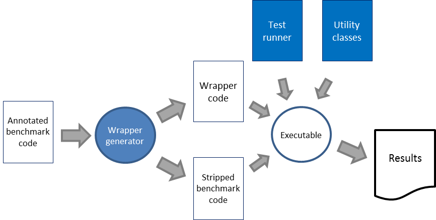
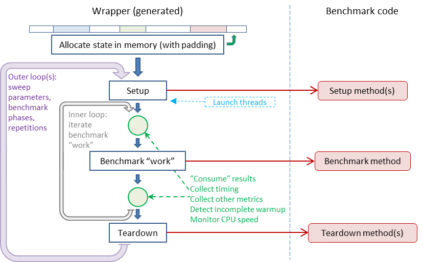

Cross-Language Microbenchmark Harness (CLAMH) User’s Guide

March, 2021

***

Table of Contents

  - [1 What is CLAMH?](#1-what-is-clamh?)
  - [2 Purpose](#2-purpose)
  - [3 Definitions](#3-definitions)
  - [4 Operation Flow](#4-operation-flow)
  - [5 Quick Start](#5-quick-start)
    - [5.1 Build CLAMH (and other libraries)](#5.1-build-clamh-and-other-libraries)
    - [5.2 Run a benchmark](#5.2-run-a-benchmark)
  - [6 CLAMH Components](#6-clamh-components)
    - [6.1 clamh.rc](#6.1-clamh.rc)
    - [6.2 clamh-cpp](#6.2-clamh-cpp)
    - [6.3 JMH project directory](#6.3-jmh-project-directory)
    - [6.4 Scripts](#6.4-scripts)
      - [6.4.1 Building Java benchmarks](#6.4.1-building-java-benchmarks)
      - [6.4.2 Building C++ benchmarks](#6.4.2-building-c++-benchmarks)
    - [6.5 Sample_scripts](#6.5-sample_scripts)
      - [6.5.1 clamh_exec_all.sh](#6.5.1-clamh_exec_all.sh)
      - [6.5.2 clamh_run_slurm.sh](#6.5.2-clamh_run_slurm.sh)
    - [6.6 Benchmarks](#6.6-benchmarks)
    - [6.7 Documentation](#6.7-documentation)
  - [7 Benchmark Construction and Design](#7-benchmark-construction-and-design)
    - [7.1 Benchmark Harness Wrapper](#7.1-benchmark-harness-wrapper)
    - [7.2 Form of a CLAMH/JMH Benchmark (Single threaded)](#7.2-form-of-a-clamh/jmh-benchmark-single-threaded)
      - [7.2.1 The @Benchmark Function](#7.2.1-the-@benchmark-function)
      - [7.2.2 The Benchmark Mode](#7.2.2-the-benchmark-mode)
      - [7.2.3 @State Objects](#7.2.3-@state-objects)
      - [7.2.4 Blackhole objects](#7.2.4-blackhole-objects)
      - [7.2.5 @Setup and @Teardown](#7.2.5-@setup-and-@teardown)
    - [7.3 Benchmark guidelines](#7.3-benchmark-guidelines)
      - [7.3.1 Unwanted optimization](#7.3.1-unwanted-optimization)
        - [7.3.1.1 Loops](#7.3.1.1-loops)
        - [7.3.1.2 Warmup and inlining](#7.3.1.2-warmup-and-inlining)
        - [7.3.1.3 Dead code elimination](#7.3.1.3-dead-code-elimination)
        - [7.3.1.4 Constant folding](#7.3.1.4-constant-folding)
        - [7.3.1.5 Data regularity](#7.3.1.5-data-regularity)
      - [7.3.2 Reproducibility](#7.3.2-reproducibility)
        - [7.3.2.1 Random numbers](#7.3.2.1-random-numbers)
        - [7.3.2.2 Memory usage](#7.3.2.2-memory-usage)
      - [7.3.3 Multi-threaded benchmarks](#7.3.3-multi-threaded-benchmarks)
        - [7.3.3.1 False sharing](#7.3.3.1-false-sharing)
        - [7.3.3.2 Thread start/stop skew](#7.3.3.2-thread-start/stop-skew)
      - [7.3.4 Porting benchmarks](#7.3.4-porting-benchmarks)
        - [7.3.4.1 Target language expertise and code quality](#7.3.4.1-target-language-expertise-and-code-quality)
        - [7.3.4.2 Algorithmic equivalence rule (and when to break it)](#7.3.4.2-algorithmic-equivalence-rule)
    - [7.4 Support Classes](#7.4-support-classes)
      - [7.4.1 Blackhole](#7.4.1-blackhole)
    - [7.5 Annotations](#7.5-annotations)
    - [7.6 Parallel (multi-threaded) benchmarks](#7.6-parallel-(multi-threaded)-benchmarks)
  - [8 CLAMH C++](#8-clamh-c++)
    - [8.1 Benchmark file](#8.1-benchmark-file)
      - [8.1.1 Compiling outside of CLAMH](#8.1.1-compiling-outside-of-clamh)
      - [8.1.2 Method semantics](#8.1.2-method-semantics)
    - [8.2 Classes](#8.2-classes)
    - [8.3 CLAMH C++ Annotations](#8.3-clamh-c++-annotations)
      - [8.3.1 Alternate Notation Syntax](#8.3.1-alternate-notation-syntax)
      - [8.3.2 Supported annotations](#8.3.2-supported-annotations)
    - [8.4 Building the benchmark runtime](#8.4-building-the-benchmark-runtime)
    - [8.5 Benchmark runtime options](#8.5-benchmark-runtime-options)
  - [9 JMH (for Java benchmarks)](#9-jmh-for-java-benchmarks)
    - [9.1 JMH Setup](#9.1-jmh-setup)
    - [9.2 Getting the JMH source code and building it to create the API JavaDocs…](#9.2-getting-the-jmh-source-code)
    - [9.3 Benchmark file](#9.3-benchmark-file)
    - [9.4 Classes](#9.4-classes)
    - [9.5 Annotations](#9.5-annotations)
    - [9.6 Building the benchmark jar file](#9.6-building-the-benchmark-jar-file)
    - [9.7 Benchmark runtime options](#9.7-benchmark-runtime-options)
  - [10 CLAMH JS](#10-clamh-js)
  - [11 Limitations, Future Growth, and Reporting Issues](#11-limitations,-future-growth,-and-reporting-issues)
  - [12 Advanced Topics](#12-advanced-topics)
    - [12.1 Controlling the Environment](#12.1-controlling-the-environment)
      - [12.1.1 Variations in CPU frequency](#12.1.1-variations-in-cpu-frequency)
      - [12.1.2 Interference from other processes](#12.1.2-interference-from-other-processes)
      - [12.1.3 Internal interference](#12.1.3-internal-interference)
      - [12.1.4 File system](#12.1.4-file-system)
    - [12.2 Drilling Down - Benchmark Harness Details](#12.2-drilling-down---benchmark-harness-details)
      - [12.2.1 Undesired over-optimization](#12.2.1-undesired-over-optimization)
        - [12.2.1.1 Dead code elimination](#12.2.1.1-dead-code-elimination)
        - [12.2.1.2 Constant folding](#12.2.1.2-constant-folding)
      - [12.2.2 Memory issues](#12.2.2-memory-issues)
        - [12.2.2.1 Memory layout and determinism](#12.2.2.1-memory-layout-and-determinism)
        - [12.2.2.2 False sharing](#12.2.2.2-false-sharing)
        - [12.2.2.3 NUMA hardware](#12.2.2.3-numa-hardware)
      - [12.2.3 Warmup](#12.2.3-warmup)
      - [12.2.4 Measuring time correctly](#12.2.4-measuring-time-correctly)
        - [12.2.4.1 Accuracy](#12.2.4.1-accuracy)
        - [12.2.4.2 Thread skew](#12.2.4.2-thread-skew)
      - [12.2.5 Benchmark Harness Loop Structure](#12.2.5-benchmark-harness-loop-structure)
    - [12.3 CPU frequency monitoring](#12.3-cpu-frequency-monitoring)
    - [12.4 Deep performance analysis](#12.4-deep-performance-analysis)
    - [12.5 PORTING BENCHMARKS TO CLAMH/JMH - A PRIMER](#12.5-porting-benchmarks-to-CLAMH/JMH---a-primer)
      - [12.5.1 Walkthrough and tutorial](#12.5.1-walkthrough-and-tutorial)

***

# 1 What is CLAMH?

CLAMH is

1.  A language-independent benchmark harness design

2.  The implementation of that design for different languages.

The CLAMH design closely follows the design of JMH, the preeminent benchmark harness
for Java. Since the Java Micro-benchmark Harness (JMH) already achieves the
goals of CLAMH for the Java language, the runnable benchmark files generated by CLAMH
for other languages are designed to be directly comparable to JMH benchmarks for
Java.

***

# 2 Purpose

There is often a need to compare the performance of the same benchmark
implemented in different languages and/or run in different frameworks.
Successful and accurate performance comparison depends on the elimination of as
many confounding variables as possible. One source of confounding variables is
the variation in benchmark harness design, capability, and quality for different
languages/platforms.

CLAMH seeks to provide a common benchmark harness that will allow benchmark
implementations in different languages to run in a test environment that is
as consistent as possible, and thereby enable a more “apples to apples”
comparison.

CLAMH also provides a benchmark harness environment that will assist benchmark
developers and users in avoiding many of the pitfalls associated with
micro-benchmarking that can result in inaccurate or unreliable results.

However, note that while a well-designed benchmark harness can take much of the
burden off of the shoulders of the micro-benchmark developer, the benchmark harness
cannot remove *all* of the potential hazards which can trap the unwary
developer. Guidelines and practices to avoid these can be found in Section 7.3,
Benchmark guidelines.

***

# 3 Definitions

These are some terms that will be used throughout this document.

-   The *target language* is the language in which the benchmark is written.

-   The *target platform* indicates the environment in which the benchmark will
    run (e.g., as a native binary, within a specific virtual machine (VM),
    within a specific interpreter, etc.)

-   An *invocation* is a single call to a benchmark method.

-   An *operation* is a unit of work. By default, each invocation is a single
    operation, although this can be modified through annotations.

-   An *iteration* is one set of successive operations. This is the smallest
    quantity of work for which measurements are reported. The definition of an
    iteration depends on the benchmark *mode* that is specified (See Section
    7.2.2, The Benchmark Mode, for more details).

-   *Warmup iterations* are initial iterations that are performed in order to
    warm up the target platform. Measurement associated with these iterations
    are not included in the reported statistics.

-   *Benchmark iterations* are iterations carried out after warmup. These are
    the iterations used to generate the performance results.

***

# 4 Operation Flow

The operation flow is shown in Figure 1.

Figure 1 Operation Flow

1.  A file containing the annotated benchmark code is provided by the user.

2.  The wrapper generator parses the annotations in the benchmark file to
    produce the benchmark wrapper code along with a copy of the benchmark code
    with the annotations stripped (or commented) out.

3.  The wrapper code, stripped benchmark code, test runner, and utility classes
    are used to build the runnable file.

4.  The runnable file is run to produce the test results.

In order to provide the optimal testing environment for accurate benchmark
measurement, CLAMH first scans the benchmark source code and generates the
appropriate benchmark harness code for that benchmark. The benchmark developer uses
annotations within the benchmark code to provide meta-information that indicates
how CLAMH should run the benchmark (see Section 7.5, Annotations).

***

# 5 Quick Start

This section outlines the minimal steps that the user needs to follow in order
to get started using CLAMH. They include the steps necessary to:

-   Install and build CLAMH (and other libraries)

-   Run one of the included benchmarks

For further information, consult:

-   Section 6, CLAMH Components, for details on the CLAMH structure and
    organization.

-   Section 7, Benchmark Construction and Design, for guidance on writing your
    own benchmarks.

-   Section 8, CLAMH C++, for more details on running C++ benchmarks.

-   Section 9, JMH (for Java benchmarks), for more details on running Java
    benchmarks.

-   Section 12, Advanced Topics, for a deeper dive into some advanced topics.

## 5.1 Build CLAMH (and other libraries)

**Step 1**: Clone CLAMH from the GitHub repository:

~~~~~~~~~~~~~~~~~~~~~~~~~~~~~~~~~~~~~~~~~~~~~~~~~~~~~~~~~~~~~~~~~~~~~~~~~~~~~~~~
git clone <GitHub link>
~~~~~~~~~~~~~~~~~~~~~~~~~~~~~~~~~~~~~~~~~~~~~~~~~~~~~~~~~~~~~~~~~~~~~~~~~~~~~~~~

**Step 2**: Install other libraries and utilities, if needed:

In order to build and run Java benchmarks, your environment must have the
JavaJDK and Maven installed. To test that these are installed (and in your
path), enter the following:

~~~~~~~~~~~~~~~~~~~~~~~~~~~~~~~~~~~~~~~~~~~~~~~~~~~~~~~~~~~~~~~~~~~~~~~~~~~~~~~~
java --version
mvn --version
~~~~~~~~~~~~~~~~~~~~~~~~~~~~~~~~~~~~~~~~~~~~~~~~~~~~~~~~~~~~~~~~~~~~~~~~~~~~~~~~

The Java version should be 8.0 or newer, and Maven version 3.6 or newer is
recommended.

**Step 3**: Set environment variables:

The easiest way to do this is to source the clamh.rc file located in the
top-level clamh directory:

~~~~~~~~~~~~~~~~~~~~~~~~~~~~~~~~~~~~~~~~~~~~~~~~~~~~~~~~~~~~~~~~~~~~~~~~~~~~~~~~
source <path_to_clamh_directory>/clamh.rc	
~~~~~~~~~~~~~~~~~~~~~~~~~~~~~~~~~~~~~~~~~~~~~~~~~~~~~~~~~~~~~~~~~~~~~~~~~~~~~~~~

This will:

-   Set environment variable CLAMH_HOME to the path to the top-level clamh
    directory.

-   Add $CLAMH_HOME/scripts to your path.

**Step 4**: Build the CLAMH-C++ benchmark harness generator and the JMH benchmark
project directory used by CLAMH (for Java benchmarks):

CLAMH provides a Makefile that will do this for you:

~~~~~~~~~~~~~~~~~~~~~~~~~~~~~~~~~~~~~~~~~~~~~~~~~~~~~~~~~~~~~~~~~~~~~~~~~~~~~~~~
cd $CLAMH_HOME
make
~~~~~~~~~~~~~~~~~~~~~~~~~~~~~~~~~~~~~~~~~~~~~~~~~~~~~~~~~~~~~~~~~~~~~~~~~~~~~~~~

If successful, you should see something like the following:

~~~~~~~~~~~~~~~~~~~~~~~~~~~~~~~~~~~~~~~~~~~~~~~~~~~~~~~~~~~~~~~~~~~~~~~~~~~~~~~~
======================
Building clamh-cpp:
======================
make[1]: Entering directory `your-path-to-clamh/clamh-cpp'

Building cpp_parser
make cpp_parser
make[2]: Entering directory `your-path-to-clamh/clamh-cpp'
flex -L -o cpp_parser.cpp cpp_parser.l
g++ -std=gnu++11 -c cpp_parser.cpp
g++ -std=gnu++11 -o cpp_parser cpp_parser.o
make[2]: Leaving directory `your-path-to-clamh/clamh-cpp'
make[1]: Leaving directory `your-path-to-clamh/clamh-cpp'

============================================
Building JMH benchmark project directory:
============================================
make[1]: Entering directory `your-path-to-clamh/jmh'
mvn archetype:generate -DinteractiveMode=false -DarchetypeGroupId=org.openjdk.jmh -DarchetypeArtifactId=jmh-java-benchmark-archetype -DgroupId=clamh -DartifactId=clamh_bm -Dversion=1.0
[INFO] Scanning for projects...
[INFO] 
[INFO] ------------------< org.apache.maven:standalone-pom >-------------------
[INFO] Building Maven Stub Project (No POM) 1
[INFO] --------------------------------[ pom ]---------------------------------
[INFO] 
[INFO] >>> maven-archetype-plugin:3.1.2:generate (default-cli) > generate-sources @ standalone-pom >>>
[INFO] 
[INFO] <<< maven-archetype-plugin:3.1.2:generate (default-cli) < generate-sources @ standalone-pom <<<
[INFO] 
[INFO] 
[INFO] --- maven-archetype-plugin:3.1.2:generate (default-cli) @ standalone-pom ---
[INFO] Generating project in Batch mode
[INFO] ----------------------------------------------------------------------------
[INFO] Using following parameters for creating project from Archetype: jmh-java-benchmark-archetype:1.0
[INFO] ----------------------------------------------------------------------------
[INFO] Parameter: groupId, Value: clamh
[INFO] Parameter: artifactId, Value: clamh_bm
[INFO] Parameter: version, Value: 1.0
[INFO] Parameter: package, Value: clamh
[INFO] Parameter: packageInPathFormat, Value: clamh
[INFO] Parameter: package, Value: clamh
[INFO] Parameter: version, Value: 1.0
[INFO] Parameter: groupId, Value: clamh
[INFO] Parameter: artifactId, Value: clamh_bm
[INFO] Project created from Archetype in dir: your-path-to-clamh/jmh/clamh_bm
[INFO] ------------------------------------------------------------------------
[INFO] BUILD SUCCESS
[INFO] ------------------------------------------------------------------------
[INFO] Total time: elapsed time
[INFO] Finished at: dateTtime
[INFO] ------------------------------------------------------------------------
make[1]: Leaving directory `your-path-to-clamh/jmh'
~~~~~~~~~~~~~~~~~~~~~~~~~~~~~~~~~~~~~~~~~~~~~~~~~~~~~~~~~~~~~~~~~~~~~~~~~~~~~~~~

## 5.2 Run a benchmark

Here, we will build and run the factorial benchmarks as an example.

*Step 1*: Generate and build the benchmark harness runnable files

(In these examples, we’re going to use the Factorial Benchmark tests.)

First, navigate to the benchmark directory:

~~~~~~~~~~~~~~~~~~~~~~~~~~~~~~~~~~~~~~~~~~~~~~~~~~~~~~~~~~~~~~~~~~~~~~~~~~~~~~~~
cd $CLAMH_HOME/benchmarks/fac_tests
~~~~~~~~~~~~~~~~~~~~~~~~~~~~~~~~~~~~~~~~~~~~~~~~~~~~~~~~~~~~~~~~~~~~~~~~~~~~~~~~

Then generate and build the Java and C++ benchmarks. The easiest way to do this
is to use the included scripts.

*C++:*

~~~~~~~~~~~~~~~~~~~~~~~~~~~~~~~~~~~~~~~~~~~~~~~~~~~~~~~~~~~~~~~~~~~~~~~~~~~~~~~~
clamh_build_cpp.sh factorial.cpp
~~~~~~~~~~~~~~~~~~~~~~~~~~~~~~~~~~~~~~~~~~~~~~~~~~~~~~~~~~~~~~~~~~~~~~~~~~~~~~~~

If successful, you should see the following output:

~~~~~~~~~~~~~~~~~~~~~~~~~~~~~~~~~~~~~~~~~~~~~~~~~~~~~~~~~~~~~~~~~~~~~~~~~~~~~~~~
Generating benchmark harness...
Building binary...
Done. run_factorial built.
~~~~~~~~~~~~~~~~~~~~~~~~~~~~~~~~~~~~~~~~~~~~~~~~~~~~~~~~~~~~~~~~~~~~~~~~~~~~~~~~

*Java:*

~~~~~~~~~~~~~~~~~~~~~~~~~~~~~~~~~~~~~~~~~~~~~~~~~~~~~~~~~~~~~~~~~~~~~~~~~~~~~~~~
clamh_build_java.sh Factorial.java
~~~~~~~~~~~~~~~~~~~~~~~~~~~~~~~~~~~~~~~~~~~~~~~~~~~~~~~~~~~~~~~~~~~~~~~~~~~~~~~~

If successful, the output should look something like this:

~~~~~~~~~~~~~~~~~~~~~~~~~~~~~~~~~~~~~~~~~~~~~~~~~~~~~~~~~~~~~~~~~~~~~~~~~~~~~~~~
Preparing benchmark project directory...
Building jar file...
[INFO] Scanning for projects...
[INFO] 
[INFO] ----------------------------< clamh:clamh_bm >----------------------------
[INFO] Building Auto-generated JMH benchmark 1.0
[INFO] --------------------------------[ jar ]---------------------------------
[INFO] 
[INFO] --- maven-clean-plugin:2.5:clean (default-clean) @ clamh_bm ---
[INFO] 
[INFO] --- maven-resources-plugin:2.6:resources (default-resources) @ clamh_bm ---
[INFO] Using 'UTF-8' encoding to copy filtered resources.
[INFO] skip non existing resourceDirectory your-path-to-clamh/jmh/clamh_bm/src/main/resources
[INFO] 
[INFO] --- maven-compiler-plugin:3.1:compile (default-compile) @ clamh_bm ---
[INFO] Changes detected - recompiling the module!
[INFO] Compiling 1 source file to your-path-to-clamh/jmh/clamh_bm/target/classes
[INFO] 
[INFO] --- maven-resources-plugin:2.6:testResources (default-testResources) @ clamh_bm ---
[INFO] Using 'UTF-8' encoding to copy filtered resources.
[INFO] skip non existing resourceDirectory your-path-to-clamh/jmh/clamh_bm/src/test/resources
[INFO] 
[INFO] --- maven-compiler-plugin:3.1:testCompile (default-testCompile) @ clamh_bm ---
[INFO] No sources to compile
[INFO] 
[INFO] --- maven-surefire-plugin:2.17:test (default-test) @ clamh_bm ---
[INFO] No tests to run.
[INFO] 
[INFO] --- maven-jar-plugin:2.4:jar (default-jar) @ clamh_bm ---
[INFO] Building jar: your-path-to-clamh/jmh/clamh_bm/target/clamh_bm-1.0.jar
[INFO] 
[INFO] --- maven-shade-plugin:2.2:shade (default) @ clamh_bm ---
[INFO] Including org.openjdk.jmh:jmh-core:jar:1.0 in the shaded jar.
[INFO] Including net.sf.jopt-simple:jopt-simple:jar:4.6 in the shaded jar.
[INFO] Including org.apache.commons:commons-math3:jar:3.2 in the shaded jar.
[INFO] Replacing your-path-to-clamh/jmh/clamh_bm/target/benchmarks.jar with your-path-to-clamh/jmh/clamh_bm/target/clamh_bm-1.0-shaded.jar
[INFO] 
[INFO] --- maven-install-plugin:2.5.1:install (default-install) @ clamh_bm ---
[INFO] Installing your-path-to-clamh/jmh/clamh_bm/target/clamh_bm-1.0.jar to your-home-dir/.m2/repository/clamh/clamh_bm/1.0/clamh_bm-1.0.jar
[INFO] Installing your-path-to-clamh/jmh/clamh_bm/pom.xml to your-home-dir/.m2/repository/clamh/clamh_bm/1.0/clamh_bm-1.0.pom
[INFO] ------------------------------------------------------------------------
[INFO] BUILD SUCCESS
[INFO] ------------------------------------------------------------------------
[INFO] Total time: elapsed time
[INFO] Finished at: dateTtime
[INFO] ------------------------------------------------------------------------
your-path-to-clamh/benchmarks/fac_tests
Done. run_Factorial.jar built.
~~~~~~~~~~~~~~~~~~~~~~~~~~~~~~~~~~~~~~~~~~~~~~~~~~~~~~~~~~~~~~~~~~~~~~~~~~~~~~~~

If both have been successful, the scripts should have built the CLAMH-C++
binary “run_factorial” and JMH jar file “run_Factorial.jar”.

*Step 2:* Run the benchmarks:

clamh/sample_scripts contains some example scripts that can be used to run
benchmarks. You can use them “as is” or use them as a template for building your
own scripts.

Here, we’ll use one of the provided scripts, as that is the quickest and easiest
method:

Use the *clamh_exec_all.sh* script to run the benchmark:

~~~~~~~~~~~~~~~~~~~~~~~~~~~~~~~~~~~~~~~~~~~~~~~~~~~~~~~~~~~~~~~~~~~~~~~~~~~~~~~~
$CLAMH_HOME/sample_scripts/clamh_exec_all.sh –-cpp=run_factorial –-java=run_Factorial.jar –o results/run1 > run1.out
~~~~~~~~~~~~~~~~~~~~~~~~~~~~~~~~~~~~~~~~~~~~~~~~~~~~~~~~~~~~~~~~~~~~~~~~~~~~~~~~

This script will run the C++ binary (run_factorial) and it will run the
Java jar file (run_Factorial.jar) on your local Java VM. Once all of these have
run once, the script will run each of them a second time.

The primary results in text format are written to stdout, which we have
redirected here to file “run1.out”. Additional supplementary output files will
be written to directory “results” with base file name “run1”.

Here is an example of what the primary results should look like:

<pre>
$CLAMH_HOME/sample_scripts/clamh_exec_all.sh --cpp=run_factorial --java=run_Factorial.jar –o results/run1

Running benchmarks:
  C++ benchmark run_factorial
  Java benchmark run_Factorial.jar
    will run on Java VM at <i>your_java_location</i>

Supplementary output files will be written to "results"

Hostname: abcde001
Start: Sun Feb  7 06:37:06 PDT 2021

================================================================================
Environment information:
================================================================================

OS:  Linux (linux-gnu)

System info:
(from uname)
Linux abcde001 4.1.12-112.14.13.el7uek.x86_64 #2 SMP Sun Jan 18 11:38:29 PST 2018 x86_64 x86_64 x86_64 GNU/Linux

Processor info:
(from lscpu)
Architecture:          x86_64
CPU op-mode(s):        32-bit, 64-bit
Byte Order:            Little Endian
CPU(s):                56
On-line CPU(s) list:   0-55
Thread(s) per core:    2
Core(s) per socket:    14
Socket(s):             2
NUMA node(s):          2
Vendor ID:             GenuineIntel
CPU family:            6
Model:                 79
Model name:            Intel(R) Xeon(R) CPU E5-2690 v4 @ 2.60GHz

<i>Additional details of the processor, memory, and current background activity here</i>
.
.
.

================================================================================
Benchmark results:
================================================================================

================================================================================
Run C++
CLAMH version: 0.5.0
Compiler version: g++ 7.3.0
./run_factorial -trendfile results/run1_cpp_1.trends -rf json -rff results/run1_cpp_1.json 

CPU speed and warmup trends written to file results/run1_cpp_1.trends
Results written to JSON file: results/run1_cpp_1.json
high-resolution clock: estimated precision: 5.07418
system clock: estimated precision: 7.05569
steady clock exceeds precision limit
Using the system clock

Parameter values:
    Benchmarks::InputValue::number = 25

Benchmark: Benchmarks::factorialRecursive
Benchmark mode: Average time, time/op
Threads: 1 threads
Warmup: 5 iterations, 1 s each
Measurement: 5 iterations, 1 s each
Parameters: (Benchmarks::InputValue::number = 25)

Benchmark Benchmarks::factorialRecursive, warmup iteration 1: 44.1196 ns/op
Benchmark Benchmarks::factorialRecursive, warmup iteration 2: 41.1104 ns/op
Benchmark Benchmarks::factorialRecursive, warmup iteration 3: 41.4085 ns/op
Benchmark Benchmarks::factorialRecursive, warmup iteration 4: 46.9684 ns/op
Benchmark Benchmarks::factorialRecursive, warmup iteration 5: 42.216 ns/op
Benchmark Benchmarks::factorialRecursive, iteration 1: 42.1703 ns/op
Benchmark Benchmarks::factorialRecursive, iteration 2: 43.6667 ns/op
Benchmark Benchmarks::factorialRecursive, iteration 3: 43.0568 ns/op
Benchmark Benchmarks::factorialRecursive, iteration 4: 44.1157 ns/op
Benchmark Benchmarks::factorialRecursive, iteration 5: 46.6927 ns/op

Result for Benchmarks::factorialRecursive:
  43.9404 ±(99.9%) 5.86354 ns/op
  (min, avg, max) = (42.1703, 43.9404, 46.6927), stdev = 1.5228

<i>Additional detailed results for other benchmark methods and/or parameter values</i>
.
.
.

Benchmark                       (number)   Mode    Cnt     Score         Error   Units
Benchmarks::factorialRecursive        25   avgt      5    43.9404 +/-  5.86354   ns/op
Benchmarks::factorialRecursive        30   avgt      5    49.7267 +/-  2.22687   ns/op

================================================================================
Run Java
java version "1.8.0_72"
Java(TM) SE Runtime Environment (build 1.8.0_72-b15)
Java HotSpot(TM) 64-Bit Server VM (build 25.72-b15, mixed mode)
# VM invoker: <i>your_path_to_GraalVM</i>/graalvm-ee-1.0.0-rc9/jre/bin/java
# VM options: <none>
# Warmup: 5 iterations, 1 s each
# Measurement: 5 iterations, 1 s each
# Threads: 1 thread, will synchronize iterations
# Benchmark mode: Average time, time/op
# Benchmark: clamh.Factorial.JavaFactorialRecursive
# Parameters: (number = 25)

# Run progress: 0.00% complete, ETA 00:06:25
# Fork: 1 of 1
# Warmup Iteration   1: 60.755 ns/op
# Warmup Iteration   2: 27.567 ns/op
# Warmup Iteration   3: 22.327 ns/op
# Warmup Iteration   4: 21.321 ns/op
# Warmup Iteration   5: 22.419 ns/op
Iteration   1: 21.296 ns/op
Iteration   2: 23.150 ns/op
Iteration   3: 25.137 ns/op
Iteration   4: 21.689 ns/op
Iteration   5: 22.157 ns/op

Result: 22.686 ±(99.9%) 5.911 ns/op [Average]
  Statistics: (min, avg, max) = (21.296, 22.686, 25.137), stdev = 1.535
  Confidence interval (99.9%): [16.774, 28.597]

<i>Additional detailed results for other benchmark methods and/or parameter values</i>
.
.
.

Benchmark                              (number)  Mode  Samples   Score  Score error  Units
l.Factorial.JavaFactorialRecursive           25  avgt        5  22.686        5.911  ns/op
l.Factorial.JavaFactorialRecursive           30  avgt        5  27.329        4.652  ns/op

<i>These will be followed by additional repetitions of each benchmark with summary</i>
<i>information at the end of each.</i>
.
.
.

End: Sun Feb  7 07:50:25 PDT 2021
</pre>

***

# 6 CLAMH Components

This section gives an overview of the components of CLAMH. The top-level CLAMH
directory contains clamh.rc, and has the following subdirectories: clamh-cpp, jmh,
scripts, sample_scripts, benchmarks, and documentation.

To build the components and create the JMH project directory, run “make” from
the top-level directory:

~~~~~~~~~~~~~~~~~~~~~~~~~~~~~~~~~~~~~~~~~~~~~~~~~~~~~~~~~~~~~~~~~~~~~~~~~~~~~~~~
cd clamh
make
~~~~~~~~~~~~~~~~~~~~~~~~~~~~~~~~~~~~~~~~~~~~~~~~~~~~~~~~~~~~~~~~~~~~~~~~~~~~~~~~

## 6.1 clamh.rc

clamh.rc is a script file located in the top-level CLAMH directory that is
provided as a convenience. Sourcing this file will correctly set the CLAMH_HOME
environment variable and add the appropriate CLAMH directories your PATH.

~~~~~~~~~~~~~~~~~~~~~~~~~~~~~~~~~~~~~~~~~~~~~~~~~~~~~~~~~~~~~~~~~~~~~~~~~~~~~~~~
source <path_to_clamh_directory>/clamh.rc	
~~~~~~~~~~~~~~~~~~~~~~~~~~~~~~~~~~~~~~~~~~~~~~~~~~~~~~~~~~~~~~~~~~~~~~~~~~~~~~~~

## 6.2 clamh-cpp

$CLAMH_HOME/clamh-cpp/ contains the source code and build files for the C++
implementation of CLAMH, including the benchmark harness generator and the header
files used by the generated benchmark harness code.

The typical user will interact with the tools in this file indirectly through
the build scripts provided in $CLAMH_HOME/scripts.

## 6.3 JMH project directory

Running “make” from the top-level CLAMH directory or from $CLAMH_HOME/jmh will
build the default JMH project directory ($CLAMH_HOME/jmh/clamh_bm) that will be
used to generate the benchmark harness and compile Java benchmarks.

The typical user will interact with this project file indirectly through the
build scripts provided in $CLAMH_HOME/scripts.

## 6.4 Scripts

$CLAMH_HOME/scripts/ contains scripts that streamline and normalize the build
process. These scripts are detailed below.

If you source clamh.rc (see above), this directory will be included in your PATH.

### 6.4.1 Building Java benchmarks

`clamh_build_java.sh [(optional) <JMH project directory>] <java source
filenames>...`

This script takes one or more Java benchmark source files and uses the Java
Microbenchmark Harness (JMH) to generate the corresponding benchmark harness and
compile them into a jar file. The script takes care of populating the project
directory with the source files in the appropriate package directories and
copies the resulting jar file back to your benchmark directory. The jar file
name will be based on the name of the first source file on the command line with
“run_” prepended.

Unless the path to a JMH project directory is specified, then the JMH benchmark
project directory at $CLAMH_HOME/jmh/clamh_bm will be used by default (run “make”
from the top-level directory to create the project directory).

*Examples:*

~~~~~~~~~~~~~~~~~~~~~~~~~~~~~~~~~~~~~~~~~~~~~~~~~~~~~~~~~~~~~~~~~~~~~~~~~~~~~~~~
clamh_build_java.sh MyBenchmark.java	
~~~~~~~~~~~~~~~~~~~~~~~~~~~~~~~~~~~~~~~~~~~~~~~~~~~~~~~~~~~~~~~~~~~~~~~~~~~~~~~~

This uses the default JMH project directory to generate the benchmark harness and
build jar file “run_MyBenchmark.jar”.

~~~~~~~~~~~~~~~~~~~~~~~~~~~~~~~~~~~~~~~~~~~~~~~~~~~~~~~~~~~~~~~~~~~~~~~~~~~~~~~~
clamh_build_java.sh Benchmark2.java NeededClass.java MyUtilities.java	
~~~~~~~~~~~~~~~~~~~~~~~~~~~~~~~~~~~~~~~~~~~~~~~~~~~~~~~~~~~~~~~~~~~~~~~~~~~~~~~~

This uses the default JMH project directory to build the benchmark jar file from
the three specified source files. The output jar file will be named
“run_Benchmark2.jar”.

~~~~~~~~~~~~~~~~~~~~~~~~~~~~~~~~~~~~~~~~~~~~~~~~~~~~~~~~~~~~~~~~~~~~~~~~~~~~~~~~
clamh_build_java.sh ../private/jmh/bm_project Benchmark3.java
~~~~~~~~~~~~~~~~~~~~~~~~~~~~~~~~~~~~~~~~~~~~~~~~~~~~~~~~~~~~~~~~~~~~~~~~~~~~~~~~

This uses a JMH project directory located at “../private/jmh/bm_project” to
build benchmark jar file “run_Benchmark3.jar”.

### 6.4.2 Building C++ benchmarks

`clamh_build_cpp.sh [(optional) <path to clamh-cpp>] <C++ source filename>`

This script takes an annotated C++ source file and uses the generator in
clamh-cpp to build the benchmark harness and compile the benchmark harness and
benchmark into a binary file. The binary file name will be based on the source
file name with “run_” prepended.

Unless a path to clamh-cpp is specified, $CLAMH_HOME/clamh-cpp will be used by
default.

The C++ compiler specified in environment variable "CPP" will be used for
compilation. If CPP is not set, g++ will be used by default.

*Example:*

~~~~~~~~~~~~~~~~~~~~~~~~~~~~~~~~~~~~~~~~~~~~~~~~~~~~~~~~~~~~~~~~~~~~~~~~~~~~~~~~
clamh_build_cpp.sh my_benchmark.cpp	
~~~~~~~~~~~~~~~~~~~~~~~~~~~~~~~~~~~~~~~~~~~~~~~~~~~~~~~~~~~~~~~~~~~~~~~~~~~~~~~~

will generate the benchmark harness and build binary file “run_my_benchmark”.

## 6.5 Sample_scripts

$CLAMH_HOME/sample_scripts contains some examples of runtime scripts that can be
used to run your benchmarks. You can either use these scripts as written,
customize them for your environment, or use them as templates to write your own.

### 6.5.1 clamh_exec_all.sh

`clamh_exec_all.sh -h`  
`clamh_exec_all.sh [--cpp=<C++ binary>] [--java=<Java jar file>]
-o <supplementary output directory/file base name>`

This script is intended for use in running one or more versions of a benchmark
written in different languages in order to compare their performance. This will
run each of the specified benchmarks twice.

In addition, if a Java benchmark (jar file) is specified, and one or more of the
following environment variables is defined, it will run the Java benchmark on
each of the specified VMs:

JAVA_HOME_GRAALVM:   the top-level GraalVM directory  
JAVA_HOME_HOTSPOT8:  the top-level HotSpot 8 directory  
JAVA_HOME_HOTSPOT11: the top-level HotSpot 11 directory

On the second time that the benchmark is run, the order will be varied in case
there exists any order-dependent performance bias.

If none of these environment variables is defined, then any specified Java
benchmark will be run using the installed “java” runtime, if available.

The primary results will be written to stdout in text format. Additional data
formats and supplementary data will also be written to a number of output files.
The names of these supplementary output files and their location is determined
by the “output directory/file base name” argument.

*Example:*

~~~~~~~~~~~~~~~~~~~~~~~~~~~~~~~~~~~~~~~~~~~~~~~~~~~~~~~~~~~~~~~~~~~~~~~~~~~~~~~~
$CLAMH_HOME/sample_scripts/clamh_exec_all.sh --cpp=run_my_benchmark --java=run_MyBenchmark –o my_benchmark_results/test1
~~~~~~~~~~~~~~~~~~~~~~~~~~~~~~~~~~~~~~~~~~~~~~~~~~~~~~~~~~~~~~~~~~~~~~~~~~~~~~~~

will run the C++ and Java versions of the specified benchmark,
“run_my_benchmark” and “run_MyBenchmark” (previously built using the
clamh_build_*.sh scripts).

Each version will be run twice (additionally, if one
or more of the environment variables described above is set, then the Java
version of the benchmark will be run twice on each of the specified VMs). Any
supplementary data files created will be of the form
“my_benchmark_results/test1*”.

### 6.5.2 clamh_run_slurm.sh

`clamh_run_slurm.sh -h`  
`clamh_run_slurm.sh [--cpp=<C++ binary>] [--java=<Java jar file>] --exec=<script to be run>`  
` ` ` -q <queue name (may be repeated)>
-o <output directory base name>`  
` ` ` [-t <time limit (“00:15:00” by default)>] [--reps=<number of repetitions (3 by default)>]`

This is an example of a script that could be used to run comparisons of one or
more different language versions of a given benchmark in batch mode using a
Slurm queue. This sample script is specific to the Slurm environment, but the
user can copy and modify it for their own environment or use it as an example to
write their own.

*Required arguments:*

-   One or more benchmarks must be specified, either as a jar file (for Java) or
    as an runnable file (for other languages).

-   A script to be run must be specified. clamh_run_slurm.sh is written to
    accept any script whose argument signature conforms to that defined for
    clamh_exec_all.sh (see above).

-   One or more Slurm queues must be specified. The “-q” argument may be
    specified multiple times on the command line, once for each queue. Multiple
    job requests will be submitted to each queue, determined by the specified
    number of repetitions (from "--reps"); each job will run the specified
    script (from “--exec").

*Optional arguments:*

-   The time limit for each Slurm job, in “HH:MM:SS” format (“00:15:00” by
    default)

-   The number of repetitions. This determines how many times the script will be
    submitted to each queue.

The output for all of the jobs on each of the queues will be captured in
directory `<output directory base name>_<queue>`.

The primary output for each job will be written to a file in that directory
called `<label>_test_rep<N>.result`, where the `<label>` is obtained from the
benchmark name, and `<N>` is from 1 to the number of repetitions. (Likewise,
stderr for each job will be directed to `<label>_test_rep<N>.err`.)
Supplementary data files for the job will also be of the form `<label>_test_rep<N>*`.

*Example:*

~~~~~~~~~~~~~~~~~~~~~~~~~~~~~~~~~~~~~~~~~~~~~~~~~~~~~~~~~~~~~~~~~~~~~~~~~~~~~~~~
$CLAMH_HOME/sample_scripts/clamh_run_slurm.sh --cpp=run_my_benchmark --java=run_MyBenchmark
 -–exec=$CLAMH_HOME/sample_scripts/clamh_exec_all.sh -q x86_q –q foo_q –o batch_results1
~~~~~~~~~~~~~~~~~~~~~~~~~~~~~~~~~~~~~~~~~~~~~~~~~~~~~~~~~~~~~~~~~~~~~~~~~~~~~~~~

This will submit 3 jobs each (the default) to Slurm queues “x86_q” and “foo_q”.
Each job will run the following command:

~~~~~~~~~~~~~~~~~~~~~~~~~~~~~~~~~~~~~~~~~~~~~~~~~~~~~~~~~~~~~~~~~~~~~~~~~~~~~~~~
$CLAMH_HOME/sample_scripts/clamh_exec_all.sh --cpp=run_my_benchmark
--java=run_MyBenchmark –o batch_results1_<queue>/run_my_benchmark_test_rep<N>
~~~~~~~~~~~~~~~~~~~~~~~~~~~~~~~~~~~~~~~~~~~~~~~~~~~~~~~~~~~~~~~~~~~~~~~~~~~~~~~~

where `<queue>` is either “x86_q” or “foo_q”, and `<N>` is 1, 2, or 3.

The primary results for each job will be written to file:
`batch_results1_<queue>/run_my_benchmark_test_rep<N>.result`

(and stderr will be captured in
`batch_results1_<queue>/run_my_benchmark_test_rep<N>.err`).

## 6.6 Benchmarks

This contains some provided benchmarks implemented in multiple languages.

-   array2d_tests: compares row-wise and column-wise walks through 2-dimensional
    arrays

-   autobox_tests: tests Java autoboxing (and unboxing) performance, with
    equivalent behavior in C++ as a comparative baseline

-   fac_tests: compares iterative and recursive implementations of factorial
    computations

-   fibo_tests: tests Fibonacci series computations using local and nonlocal
    variables, with two hand-optimized algorithms for comparison

-   memory_tests: stresses the memory hierarchy

-   xml_transform_tests: tests the performance of an XML transform, compared to
    a copy operation (as a baseline)

These benchmarks are provided both to provide some “out of the box” examples of
how CLAMH can be used, as well as guidelines for creating your own multi-language
benchmarks.

## 6.7 Documentation

This directory contains the CLAMH User’s Guide (which you are reading now).

It also contains the SampleBrot code files that are used in the SampleBrot benchmark porting
example in Section 12.5.

***

# 7 Benchmark Construction and Design

This section discusses the structure of CLAMH benchmarks, along with general guidelines for benchmark design.

## 7.1 Benchmark Harness Wrapper

The wrapper generator extracts the annotations from the benchmark code and use
them to generate the wrapper code. The wrapper code is designed to facilitate
safe, robust, and accurate benchmark measurements.

Figure 2 benchmark harness wrapper code

The responsibilities of the wrapper code are visually depicted in the figure
above.

[Note that the figure does not cover all possible permutations (that would be
too cluttered). However, it shows some of the more common cases.]

## 7.2 Form of a CLAMH/JMH Benchmark (Single threaded)

CLAMH and JMH are different from other benchmarking frameworks, as they were
designed for *micro*-benchmarks which tend to be smaller, faster, and more
self-contained than larger benchmarks. As such, instead of defining timing
intervals in a program, CLAMH and JMH are **function based**. Each
component of the benchmark is split into one or more functions. Each function
passes key profiling parameters to CLAMH or JMH using **annotations.**

This is fine for a microbenchmark, but a larger benchmark may need to be
refactored into the following five key parts:

1.  One or more functions you annotate as @Setup - these do all of the
    initialization and are not timed.

2.  One or more functions you annotate as @Teardown - these do all necessary
    cleanup and are not timed.

3.  One or more functions you annotate as @Benchmark - the core code of your
    program that *is* timed.

4.  One or more classes or structures you annotate as @State. These should hold
    all the data needed by your benchmark, and all the *parameters* to this
    benchmark.

5.  CLAMH and JMH provide a **Blackhole object** that you use to consume values
    that are produced by your benchmark (either explicitly or implicitly).

>   Tip: When writing your own microbenchmark, it’s often easiest to take a
>   ready made CLAMH/JMH benchmark file and replace the parts above with
>   your own.

Note that, because parallelism adds complexity to understanding and use of
CLAMH/JMH, we will first describe everything for a single threaded benchmark,
and then follow up with a special section on parallelism.

We’ll now go over the main options for each of the standard functions that are
implemented for CLAMH/JMH.

### 7.2.1 The @Benchmark Function

The @Benchmark annotation is at the heart of the CLAMH/JMH paradigm. This
annotation denotes the benchmark functions or methods whose performance the test
harness will be measuring.

This function can (but is not required to) take one or more **@State** objects
and (optionally) a **Blackhole** object as its inputs, and is the only function
that is timed. (If you have more than one benchmark function, they will be
considered independent benchmarks that will be run sequentially, EXCEPT in the
case of a functionally parallel benchmark, but that is described in the parallel
benchmark section.)

### 7.2.2 The Benchmark Mode

The *benchmark mode* effects how performance is computed:

-   Throughput: how many operations per unit of time

-   Average time: average time per operation

-   Sample time: computes statistics, percentiles, and a histogram of the
    distribution of operation run times

-   Single shot: measures the time for a single operation

The benchmark mode is specified by the @BenchmarkMode annotation. (See Section
7.5, Annotations, for more information)

>   Warning! Sample time and Single shot modes attempt to measure the time for a
>   single operation. For many microbenchmarks, a single invocation of the
>   benchmark function may be too small to measure for the available timers.
>   CLAMH will output a warning in these cases. This can be alleviated by using
>   the *batchSize* argument to redefine an operation to be a specified number
>   of invocations.

**Important note:**

Performance measurement errors and biases can be introduced due to way an
*iteration* is defined. Because microbenchmarks are typically very small, the
default assumption of CLAMH/JMH is to repeatedly invoke a benchmark function for
a specified amount of *time* (for the *average time*, *throughput*, and *sample
time* modes). However, this can lead to a misleading comparison between two
languages (or even different platforms for the same language) if the benchmark
function run time for a given language and/or platform can change over repeated
invocations, whether because of the benchmark code itself, the state of memory,
hardware warmup, or (as we see with Java), the case of dynamic compilation and
optimization.

This problem can be avoided by specifying that the benchmark harness run for a
specified number of *invocations* rather than a specified amount of time.
Currently, however, the only way to do this in CLAMH/JMH is by using the
*batchSize* argument combined with the *single shot* benchmark mode. The single
shot mode measures the time taken by a single *operation*, and the *batchSize*
argument of the @Measurement and @Warmup annotations specifies the number of
invocations for each operation.

### 7.2.3 @State Objects

State classes are *defined* in the benchmark (and marked with the @State
annotation), but the State objects are *instantiated* by the benchmark harness. A State
object can be passed to any of the other CLAMH/JMH functions (benchmark, setup,
or teardown) as an argument. The State objects are allocated by CLAMH/JMH in
order to control memory alignment and (for multithreaded benchmarks) false
sharing issues.

The values contained within State objects are protected against constant
folding.

Note that, in single-threaded benchmarks, for each State object definition, only
*one* instance is created by the benchmark harness. So, in essence, the values
and fields in a State object are common across all of your benchmark
functions. In general, the State object definition should be public
(see the section specific to each given language for more details).

### 7.2.4 Blackhole objects

Any computed value that you don’t want dead-code-eliminated along with the
computation that created it must be protected. This can be done implicitly, by
returning the value from your Benchmark function and letting the benchmark
harness take care of it, or explicitly by using a Blackhole object.

The Blackhole object has a key method called consume(any variable). By consuming
a value, the Blackhole protects the computations that produced that value from
dead code elimination.

### 7.2.5 @Setup and @Teardown

These methods are used to initialize and finalize your benchmark. Some common
uses for Setup and Teardown methods include:

-   Initializing and cleaning up the State objects.

-   Outputting additional information specific to the benchmark (in Teardown).

The methods take as input one or more State objects. The parameter to the
@Setup and @Teardown annotations defines the “Level”, which determines when and 
how often they will be called:

-   @Setup(Level.Trial). = called once per Trial, i.e., Setup before any of the
    warmup and benchmark iterations, and Teardown after all iterations have been
    completed.

-   @Setup(Level.Iteration) = called once per iteration.

-   @Setup(Level.Invocation) = called before every call to each Benchmark
    method. Warning: this can only be used with sufficiently long-running
    Benchmark functions, since timing will be interrupted for each invocation.
    This is commonly used in combination with Single Shot or Sample Time
    benchmark modes.

## 7.3 Benchmark guidelines

This section contains guidelines for the benchmark developer to help avoid some
common benchmarking pitfalls that can result in inaccurate, misleading, or
nondeterministic performance results.

Each section generally follows the same format: a problem is introduced and the
generally guidelines for avoiding it are discussed, which is then followed by
the specific assistance provided by CLAMH/JMH.

### 7.3.1 Unwanted optimization

Many of the pitfalls associated with benchmarking are related to avoiding
undesirable compiler optimization that can obscure or skew the performance
results of interest.

#### 7.3.1.1 Loops

In benchmarking, we are generally attempting to measure the time required for
some behavior. However, the timer granularity may often be too coarse to
accurately measure this behavior, so it is typically necessary to repeat the
behavior many times and then measure the total time required.

However, if a simple loop is employed, an aggressive compiler can combine loop
optimizations (such as unrolling, etc.) along with aggressive optimizations
across the loop iterations, and, in some cases, lift much of the calculation out
of the loop entirely.

[The JMH samples give an example of this problem where naïve loop construction
results in a measured result of 1/20th of a nanosecond to run the benchmark
code, which is clearly nonsensical.]

Thus, it is necessary to construct the loop in such a way that it suppresses
aggressive optimization across multiple loop iterations, but, at the same time,
minimizes any introduced overhead that could skew the results in the other
direction.

[Note: If doing this on your own without the aid of the CLAMH/JMH harnesses, 
inspection of the resulting compiled instructions is recommended to ensure 
that each loop iteration is run independently.]

-   The benchmark harness takes care of this by generating the loop code for
    you.  Each implementation of the benchmark harness will generate code
    appropriate for the target language that suppresses unwanted loop
    optimizations. Your code should only provide the method to be run on
    each loop iteration.

#### 7.3.1.2 Warmup and inlining

There are some cases where aggressive inlining of the benchmark code is
undesirable.

For example, if the benchmark code run during warm-up were to be inlined
separately from the benchmark code run during measurement, then the warm-up may
not apply to the actual code that is run for performance measurement!

The benchmark code should be constructed so that exactly the same code is
run during warmup and during measurement.

-   The benchmark harness takes care of this for you by controlling inlining of
    the code that invokes the benchmark method. For each benchmark method that
    you provide, the generated code will ensure that warm-up is performed
    correctly.

#### 7.3.1.3 Dead code elimination

One common source of inaccuracy in benchmarks is when an optimizing compiler
eliminates branches of the code tree that produce results that are never used.
While this is often useful in real-world applications, it is typically
undesirable in benchmarking, as benchmark code is typically an abstraction that
attempts to do a certain quanta of “work” and the results are usually not
important.

One common method used to avoid this is to “trick” the compiler into thinking
that the results are being used. It is important that this is done correctly for
the target language. Some ad hoc methods used to do this (such as returning a
computed value) can still fail, particularly when other optimizations come into
play (such as inlining). Assignment to a volatile value can circumvent this,
but, if done incorrectly, may skew the results by forcing a cache miss during
measurement.

-   Each implementation of the benchmark harness provides a Blackhole class
    which is guaranteed to correctly consume the results in a manner that is as
    lightweight as possible. The benchmark developer is responsible for assuring
    that the result of every computation is either returned by the benchmark
    method (in which case the generated code will ensure that it is consumed
    correctly) or explicitly consumed by a Blackhole object that has been passed in as
    an argument to the benchmark method.

#### 7.3.1.4 Constant folding

Smart compilers can introduce optimizations involving hard-coded constants. This
is known as *constant folding*.

For example, clever compilers can replace a divide by a constant with a
(typically much faster) sequence of operations using multiplies and shifts.
However, if the constant is standing in for a value that could be runtime
dependent in the real-world code that the benchmark is intended to represent, this
could result in artificially optimistic performance measurements.

So, it is often necessary to “trick” the compiler into believing that a value
might be runtime dependent. However, this must be done very carefully to avoid
unwanted timing issues. It is not sufficient to create a variable that is
later set to the constant value (compilers are smarter than this). Declaring the
variable to be volatile can avoid constant folding, but can skew timing by
forcing extra memory accesses each time the value is used. This problem can in
turn be circumvented, for example, by having the value to which the variable is
set dependent on the value of a dummy volatile, thereby leaving the compiler
uncertain as to the final value.

-   The benchmark harness takes care of most of this for you. You are
    responsible for ensuring that your benchmark method code does not
    inappropriately use any hard-coded constants. Instead, any constant values
    should be specified as an initialized variable in an annotated State object. 
    All annotated State objects are protected from constant-folding by the 
    benchmark harness.

#### 7.3.1.5 Data regularity

If the data used in your benchmark is overly regular (particularly in comparison
to any real-world code that this is intended to represent), then this can
optimistically skew your performance results. In particular, dynamic compilation
can take advantage of regular patterns of operations that are driven by, say,
regularities in a data array.

As the benchmark developer, you should make sure that your data is not overly
regular (unless that is explicitly desired).

-   The benchmark harness does not provide any assistance here.

### 7.3.2 Reproducibility

This section contains guidelines to help ensure that your benchmarks are
deterministic and/or reproducible.

#### 7.3.2.1 Random numbers

For reproducibility, if your benchmark makes use of a random number generator,
it should provide a mechanism to enable a specific benchmark run to be
reproduced. This is useful for both debugging as well as deeper analysis to
determine the cause of some observed behavior.

-   The benchmark harness facilitates doing this through use of the annotated
    Param feature. For example, your benchmark could output a *seed* value that
    could be used as input to exactly reproduce the data used in the run. When
    reproducing an earlier run, an annotated Param can be used to specify the
    seed on the command line (and, if a seed is not specified, the default
    behavior would be to generate a random seed). Note that the value of the
    generated seed should be output as part of a teardown method so that the
    outputting of the value does not contribute to the benchmark timing.

#### 7.3.2.2 Memory usage

The details of how data is mapped into the address space can affect the measured
performance, leading to either an inaccurate estimation of *average* performance
or the introduction of non-determinism in the benchmark measurements.

If a benchmark has a sufficiently large data footprint that cache contention
comes into play, the performance can depend on where the various data structures
are located in the address space, as different arrangements can lead to
different patterns of set collision within the cache. This can result in
nondeterministic behavior from one run to the next.

There are two main scenarios that need to be accommodated:

-   A consistent memory layout from one run to the next will help to eliminate
    false variability and give more consistent and deterministic benchmark
    results.

-   For some benchmarks, however, it may be more desirable to produce an
    accurate representation of the typical *average* behavior (e.g., if the
    fixed layout happens to hit an unrepresentative resonance or
    anti-resonance). In this situation, it may be better for the benchmark to be
    run multiple times with different random memory layouts.

>   Note: when comparing across languages and/or platforms, it may not be
>   possible to ensure that the different implementations provide equivalent
>   layouts in memory. Consequently, a random layout may often be the better
>   option for cross-language comparisons.

-   The benchmark method and/or setup should avoid allocating data on the heap
    for itself. Instead, it should delegate data allocation to the benchmark
    harness through annotated State objects. The harness has options to
    accommodate both of the scenarios detailed above.

### 7.3.3 Multi-threaded benchmarks

This section provides additional guidelines for multi-threaded benchmarks.

#### 7.3.3.1 False sharing

For multi-threaded benchmarks, one source of performance loss that can
artificially reduce your benchmark results is false sharing, where the private
data for two or more threads happens to reside in the same cache line (or,
equivalently, when private data resides on the same cache line with shared
data). This can result in repeated cache line invalidation, and has the
potential to severely degrade performance.

It is thus necessary to ensure that thread-private data is not falsely shared
with other data.

-   Again, when using the benchmark harness, the benchmark should avoid
    allocating its own data on the heap. Instead, use annotated State
    objects. The benchmark harness is responsible for allocating all of the
    State objects in memory, and it will ensure that these objects are allocated
    so as to prevent false sharing.

#### 7.3.3.2 Thread start/stop skew

When starting multiple threads, there may be some variation in the thread start
time. Threads that begin earlier may exhibit unrealistically good performance
(due to the absence of resource contention from the other threads) or bad
performance (e.g., while waiting for synchronization with another thread that
has not yet started).

It is thus necessary to ensure that timing measurements only take place when all
threads are running.

-   The benchmark harness takes care of this for you. For multi-threaded
    benchmarks, the benchmark harness will postpone timing of iterations until
    all threads have had time to start, and will end timing before the threads
    terminate.

### 7.3.4 Porting benchmarks

This section contains some guidelines for porting benchmarks between languages.

#### 7.3.4.1 Target language expertise and code quality

There is rarely benefit to be obtained by benchmarking code that is poorly
designed and constructed.

When porting a benchmark, it is necessary to have some level of expertise in the
target language so that all implementations represent the best performance and
capabilities of each language.

>   Note: this assumes that the original implementation is likewise of high
>   quality. DO NOT assume that this is true simply because a benchmark is well
>   respected or considered a “standard”. We have found a significant number of
>   widely used benchmarks that are *very* poorly implemented!

#### 7.3.4.2 Algorithmic equivalence rule (and when to break it)

It is important to eliminate as many confounding factors as possible when making
comparisons between implementations of the same benchmark in different
languages. Care should be taken to ensure that both implementations implement
the same algorithm (otherwise, you may be testing algorithmic differences rather
than differences in the language capabilities).

However, there may be exceptions to this rule due to specializations in certain
languages. (For example, R runs loops very slowly, but performs vector
operations well. Therefore, it might make sense to re-implement a loop as a
vector operation when porting a benchmark to R.)

Rule of thumb: algorithmic differences are OK if each implementation is using
the best algorithmic choice for that language. However, all such differences 
in your benchmark implementations should be *clearly* documented!

## 7.4 Support Classes

CLAMH provides support classes that benchmarks can use to facilitate accurate
performance measurement.

### 7.4.1 Blackhole

Each implementation provides a Blackhole class that allows values and results to
be safely and robustly consumed with minimal overhead. This allows the benchmark
code to avoid pitfalls such as *dead code elimination*. See the individual 
language-specific sections for more details.

## 7.5 Annotations

Annotations provide a way for the benchmark to pass meta-information to the test
harness that it needs to generate the appropriate wrapper code. Annotations are
specified by the “@” symbol followed by the annotation name, with no spaces in
between. Some annotations may accept one or more arguments (expressed as is
typical as a comma-separated list enclosed by parentheses). These arguments may
be optional.

[If the “@” symbol is an operator in a target language, another symbol will be
substituted to indicate annotations for benchmarks written in that language. See
the specific section for that language.]

| Annotation               | Description                                                                                                                                                                                                                                                                                                                                               |
|--------------------------|-----------------------------------------------------------------------------------------------------------------------------------------------------------------------------------------------------------------------------------------------------------------------------------------------------------------------------------------------------------------------------------------------------------------------------------------------------------------------------------------------------------------|
| @Benchmark               | Marks the following function or method as a Benchmark function. These are the functions that are invoked by the benchmark harness and timed. [no arguments]|
| @BenchmarkMode           | Specifies the mode for running and measuring the accompanying Benchmark function. *Required* argument. Available argument values are: <ul><li>Mode.AverageTime: average time per operation</li><li>Mode.SampleTime: samples the time for each operation and shows the distribution of the sampled times</li><li>Mode.SingleShotTime: measures the time for a single operation</li><li>Mode.Throughput: average operations per unit of time</li></ul>|
| @Measurement             | Provides details of how the measurements will be carried out for the accompanying Benchmark function. *Optional* arguments: <ul><li>iterations = <i>integer</i> (default 1): Number of times to repeat measurements with this benchmark</li><li>time = <i>integer</i> (default 1): Time to run each iteration (in the specified time units)</li><li>timeUnit = <i>the time unit</i>. Available values:<ul><li>TimeUnit.DAYS</li><li>TimeUnit.HOURS</li><li>TimeUnit.MINUTES</li><li>TimeUnit.SECONDS (*default*)</li><li>TimeUnit.MILLISECONDS</li><li>TimeUnit.MICROSECONDS</li><li>TimeUnit.NANOSECONDS</li></ul><li>batchSize = <i>integer</i> (default 1): Number of method calls per operation</li></ul>|
| @OperationsPerInvocation | Number of operations per invocation for the accompanying Benchmark function. *Optional* argument:  \<int\> (default 1): Number of operations per method call.|
| @OutputTimeUnit          | The time units in which to specify the results for the accompanying Benchmark function.  *Required* argument. Available values: <ul><li>TimeUnit.DAYS</li><li>TimeUnit.HOURS</li><li>TimeUnit.MINUTES</li><li>TimeUnit.SECONDS (*default*)</li><li>TimeUnit.MILLISECONDS</li><li>TimeUnit.MICROSECONDS</li><li>TimeUnit.NANOSECONDS</li></ul>|
| @Param                   | Defines the values to which the following State data member should be set (in the given order). The benchmarks will be run for each parameter setting (if multiple parameters are specified, it will be run for each combination of parameter values).  *Required* argument: a list of quoted values.  Example:  <ul style="list-style-type:none;"><li>@Param({"25", "30"})</li></ul> [Integer parameter values may be specified in decimal or hexadecimal (with a leading "0x").]|
| @Setup                   | Marks the following function or method as a Setup method. These will be invoked by the benchmark harness but are not timed.  *Required* argument: specify when this method is to be run. Available values:<ul><li>Level.Trial: Before the trial (default)</li><li>Level.Iteration: Before each iteration</li><li>Level.Invocation: Before each call to the benchmark method [**WARNING!!** This may result in measurement intervals that are too short for accurate measurement.]</li></ul>|
| @State                   | Marks the following class or struct definition as a State object. The benchmark harness will have the responsibility to safely instantiate the State objects and pass them as arguments to the setup, teardown, and benchmark methods (as needed). The data members of the State objects will be protected from constant folding by the benchmark harness.  *Required* argument: for multithreaded benchmarks, specify how each State object will be shared (and how many will need to be instantiated).  Available values: <ul><li>Scope.Benchmark: the most “global” state across the entire benchmark (and all threads) [used for all single-threaded benchmarks]</li><li>Scope.Group: shared by all threads within a group</li><li>Scope.Thread: private state for one thread</li></ul>|
| @Teardown                | Marks the following function or method as a Teardown method. These will be invoked by the benchmark harness but are not timed. *Required* argument: specify when this method is to be run. Available values:<ul><li>Level.Trial: After the trial (default)</li><li>Level.Iteration: After each iteration</li><li>Level.Invocation: After each call to the benchmark method (WARNING!!)</li></ul>|
| @Warmup                  | Provides details of how warmup will be carried out for the accompanying Benchmark function.  *Optional* arguments:<ul><li>iterations = <i>integer</i> (default 1): Number of warmup iterations</li><li>time = <i>integer</i> (default 1): Time to run each warmup iteration (in the specified time units)</li><li>timeUnit = <i>the time unit</i>. Available values:</li><ul><li>TimeUnit.DAYS</li><li>TimeUnit.HOURS</li><li>TimeUnit.MINUTES</li><li>TimeUnit.SECONDS (*default*)</li><li>TimeUnit.MILLISECONDS</li><li>TimeUnit.MICROSECONDS</li><li>TimeUnit.NANOSECONDS</li></ul><li>batchSize = <i>integer</i> (default 1): Number of method calls per operation</li></ul>|

## 7.6 Parallel (multi-threaded) benchmarks

For multi-threaded benchmarks, the State annotation has a *scope* paramter:

~~~~~~~~~~~~~~~~~~~~~~~~~~~~~~~~~~~~~~~~~~~~~~~~~~~~~~~~~~~~~~~~~~~~~~~~~~~~~~~~
@State(Scope.benchmark)
~~~~~~~~~~~~~~~~~~~~~~~~~~~~~~~~~~~~~~~~~~~~~~~~~~~~~~~~~~~~~~~~~~~~~~~~~~~~~~~~

where scope can be:

-   Thread - each thread has its own instance.

-   Benchmark - all threads share this one state object.

-   Group - each group of threads running a parallel benchmark will use its own
    instance. See the parallel benchmark section for details.

Note that Setup will be called once for every state object, to allow all state
objects to be initialized correctly. For example, in order to give each thread
its own work ID, a static value can be set to zero in the TearDown method and
incremented in the Setup Method. This gets trickier with parallel benchmarks.

1.  Homogeneous Parallelism (TLP)

2.  Heterogeneous (functional/producer-consumer) parallelism:

In this more complex case, different groups of threads work on different
functions simultaneously, and each single function might itself be scalar or
parallel. This is enabled in JMH in two steps:

1.  Declare more than one function a @Benchmark function. This indicates the
    heterogeneous (functional) parallelism. For example, one function might
    produce data while another might consume it, and a third monitor the entire
    benchmark process. For each function, you can declare the number of threads
    and state objects as in the homogeneous case.

2.  Set fork to zero. This is a special case value that tells JMH to run all the
    individual @benchmark functions simultaneously.

***

# 8 CLAMH C++

This section provides the details of the C++ implementation of CLAMH, including
semantics and syntax that are particular to C++.

## 8.1 Benchmark file

Here we detail the language syntax and features that are specific to the C++
implementation of CLAMH.

### 8.1.1 Compiling outside of CLAMH

CLAMH C++ provides two features to facilitate compiling benchmark code outside of
the CLAMH environment. [This can be useful, for example, for developing the
benchmark code outside of CLAMH, or to assist in porting existing code to the
CLAMH environment.]

-   The generated benchmark harness code will include the following line:

~~~~~~~~~~~~~~~~~~~~~~~~~~~~~~~~~~~~~~~~~~~~~~~~~~~~~~~~~~~~~~~~~~~~~~~~~~~~~~~~
#define CLAMH
~~~~~~~~~~~~~~~~~~~~~~~~~~~~~~~~~~~~~~~~~~~~~~~~~~~~~~~~~~~~~~~~~~~~~~~~~~~~~~~~

This enables conditional code to be included within the benchmark code when
running either within or outside the CLAMH environment.

-   CLAMH C++ also provides an alternative notation for annotations (“//@@”).
    See 8.3, CLAMH C++ Annotations.

*Example:*

An open question is how you test/develop this outside of the benchmark harness? One
way is to add a null definition of a Blackhole into your project.

Example of a null Blackhole place holder:

~~~~~~~~~~~~~~~~~~~~~~~~~~~~~~~~~~~~~~~~~~~~~~~~~~~~~~~~~~~~~~~~~~~~~~~~~~~~~~~~
#ifndef CLAMH

class Blackhole
{
template < class T >
static void consume(T val) { } // Do nothing, but at least it compiles
};

#endif // CLAMH
~~~~~~~~~~~~~~~~~~~~~~~~~~~~~~~~~~~~~~~~~~~~~~~~~~~~~~~~~~~~~~~~~~~~~~~~~~~~~~~~

### 8.1.2 Method semantics

Your annotated Benchmark methods, along with any annotated Setup and Teardown
methods, are invoked by the generated benchmark harness code. These methods can use
any of the benchmark harness-generated state objects or the provided Blackhole
object. To indicate that a method needs to use one of these objects,
specify it as a *reference* or *const-reference* argument to the method.

For example, if your C++ benchmark has a State class named “MyState”, and you
have a benchmark method Foo() that needs to read (but not modify) this state,
and also needs to (explicitly) use the Blackhole object, you could define the
method as follows:

~~~~~~~~~~~~~~~~~~~~~~~~~~~~~~~~~~~~~~~~~~~~~~~~~~~~~~~~~~~~~~~~~~~~~~~~~~~~~~~~
@Benchmark
// ... other annotations ...
void Foo(const MyState &state, harness_utils::Blackhole &bh) {
   // ... body of method ...
}
~~~~~~~~~~~~~~~~~~~~~~~~~~~~~~~~~~~~~~~~~~~~~~~~~~~~~~~~~~~~~~~~~~~~~~~~~~~~~~~~

## 8.2 Classes

CLAMH C++ defines the Blackhole class that is used to consume results and prevent
unwanted dead code elimination. It can safely consume any object in as
lightweight a manner as possible.

~~~~~~~~~~~~~~~~~~~~~~~~~~~~~~~~~~~~~~~~~~~~~~~~~~~~~~~~~~~~~~~~~~~~~~~~~~~~~~~~
namespace harness_utils {

class Blackhole {
public:
   // Destructor
   // (This sinks all of the local sink targets to the volatile final sinks to
   // prevent a *really* smart compiler from compiling out the local sinks.)
   ~Blackhole();

   // Type-specific consume methods for the built-in types:
   void consume(char val);
   void consume(short val);
   void consume(int val);
   void consume(long val);
   void consume(long long val);
   void consume(signed char val);
   void consume(unsigned char val);
   void consume(unsigned short val);
   void consume(unsigned int val);
   void consume(unsigned long val);
   void consume(unsigned long long val);
   void consume(float val);
   void consume(double val);

   // Generic template consume method for any other types
   // (generally, don't do this - it's slower. Better to only consume
   // the built-in types)
   template <typename T>
   void consume(const T& val;
};

}
~~~~~~~~~~~~~~~~~~~~~~~~~~~~~~~~~~~~~~~~~~~~~~~~~~~~~~~~~~~~~~~~~~~~~~~~~~~~~~~~

The Blackhole definition is automatically included by the generated benchmark
harness code.

## 8.3 CLAMH C++ Annotations

This subsection discusses the annotation details specific to the C++
implementation of CLAMH.

### 8.3.1 Alternate Notation Syntax

CLAMH C++ provides an alternate notation for annotations, where “@” is replaced
by “//@@”. This enables benchmark code to compile outside of CLAMH, which can
be useful for code development outside of CLAMH. See 8.1.1, Compiling outside of
CLAMH.

### 8.3.2 Supported annotations

The following annotations are currently supported by CLAMH C++:

-   Benchmark

-   BenchmarkMode

-   Measurement

-   OperationsPerInvocation

-   OutputTimeUnit

-   Param

-   Setup

-   State

-   Teardown

-   Warmup

See 7.5, Annotations, for general annotation details.

## 8.4 Building the benchmark runtime

In order to build the benchmark runtime, the annotated benchmark file is parsed
and used to generate the benchmark harness wrapper code specific to this benchmark
(the wrapper code also contains the original benchmark code with the annotations
stripped out). This is then compiled to create the test binary.

The vast majority of microbenchmarks are encapsulated within a single file. The
easiest way to build these is to use the provided build script,
clamh_build_cpp.sh (located in $CLAMH_HOME/scripts). For example:

~~~~~~~~~~~~~~~~~~~~~~~~~~~~~~~~~~~~~~~~~~~~~~~~~~~~~~~~~~~~~~~~~~~~~~~~~~~~~~~~
clamh_build_cpp.sh my_benchmark.cpp
~~~~~~~~~~~~~~~~~~~~~~~~~~~~~~~~~~~~~~~~~~~~~~~~~~~~~~~~~~~~~~~~~~~~~~~~~~~~~~~~

This will parse my_benchmark.cpp and write the generated benchmark harness
wrapper code, along with the stripped benchmark code, to *run_my_benchmark.cpp*, 
which will in turn be compiled to a binary file called *run_my_benchmark*.

If you need to modify any of these steps for your specific benchmark (e.g., to
include additional libraries), the easiest way to do this is to modify a copy of
clamh_build_cpp.sh specific to your benchmark. [An example of this can be seen in
$CLAMH_HOME/benchmarks/xml_transform_tests.]

## 8.5 Benchmark runtime options

The generated test binary has some pre-defined command-line options:

<ul style="list-style-type:none;">
<li>-h Prints the usage.</li> 
<li>-v Prints the version information.</li> 

<li>-i <i>int</i> Number of measurement iterations to do. Overrides annotations.</li> 

<li>-r <i>time</i> Run time for each iteration. Overrides annotations.
Time is specified as an integer followed by the units (e.g., -r 500ms).</li>
<ul style="list-style-type:none;">
Units:
<li>ns = nanoseconds</li>
<li>us = microseconds</li>
<li>ms = milliseconds</li>
<li>s = seconds</li>
<li>m = minutes</li>
<li>h = hours</li>
<li>d = days</li>
</ul>
 
<li>-w <i>time</i> Run time for each warmup iteration. Overrides annotations.  See
"-r" for time formatting details.</li> 

<li>-wi <i>int</i> Number of warmup iterations to do. Overrides annotations.</li> 

<li>-p <i>param</i> = <i>values</i> Parameter override: overrides the set of values for a given parameter,
specified by either the unqualified name or the fully qualified name. This
option may be used more than once on the command line for different
parameters. (Examples: “-p some_parm=3,4,5”)
[Integer parameter values may be specified in decimal or hexadecimal (with a
leading "0x").]</li> 

<li>-rf <i>format</i> Specifies the report format (currently, the only valid option is
“json”)</li> 

<li>-rff <i>filename</i> If specified, names a report file to be created. This
will contain all of the generated output data in a convenient
machine-readable format for post-processing.</li> 

<li>-trendfile <i>filename</i> If specified, the generated file will contain the
detailed trend information for warmup and for relative CPU speed
measurements at runtime. [Note: this can generate a lot of data,
particularly for long-running benchmarks!] See Section 12.3, CPU frequency
monitoring, for more details.</li>
</ul>

***

# 9 JMH (for Java benchmarks)

This section provides the details specific to JMH, which CLAMH uses to build
Java benchmarks.

JMH is the premier benchmark harness for Java benchmarks. Rather than
reinventing what JMH already does well, CLAMH utilizes JMH for building Java
benchmarks. The JMH benchmark harness follows the same design pattern used by
CLAMH, and it provides the same mechanisms to avoid benchmarking pitfalls that
CLAMH provides for other languages.

JMH is made available as part of [OpenJDK](https://openjdk.java.net/projects/code-tools/jmh/).

## 9.1 JMH Setup

-   STEP 1: Installing the latest public version of the Java JDK on your
    computer.

-   STEP 2: Configuring your shell environment

-   STEP 3. Installing maven (mvn)

-   STEP 4. Installing JMH and creating your first JMH Java project….

-   STEP 5. Building and running your JMH project…

(Building from source is NOT recommended due to dependencies on other projects.)
You may find it more convenient to download and install a ready made binary
package from the Oracle website:
https://www.oracle.com/java/technologies/javase-downloads.html

In your bash shell, set JAVA_HOME and your PATH to point to the latest java. I
use a special script to do this, specifically for when I need to do something
that needs Java. You’ll need to figure out where the install package from Step 1
put the JDK. On Macs, it’s installed in the /Library/Java/JavaVirtualMachines
directory:

~~~~~~~~~~~~~~~~~~~~~~~~~~~~~~~~~~~~~~~~~~~~~~~~~~~~~~~~~~~~~~~~~~~~~~~~~~~~~~~~
# Mac bash Example:
export PATH=/Library/Java/JavaVirtualMachines/jdk-13.0.1.jdk/Contents/Home/bin:$PATH
export JAVA_HOME=/Library/Java/JavaVirtualMachines/jdk-13.0.1.jdk/Contents/Home
~~~~~~~~~~~~~~~~~~~~~~~~~~~~~~~~~~~~~~~~~~~~~~~~~~~~~~~~~~~~~~~~~~~~~~~~~~~~~~~~

You can then verify everything worked: (I called my script profile_java.bash):

~~~~~~~~~~~~~~~~~~~~~~~~~~~~~~~~~~~~~~~~~~~~~~~~~~~~~~~~~~~~~~~~~~~~~~~~~~~~~~~~
. profile_java.bash
which java
java --version
~~~~~~~~~~~~~~~~~~~~~~~~~~~~~~~~~~~~~~~~~~~~~~~~~~~~~~~~~~~~~~~~~~~~~~~~~~~~~~~~

| STEP 3. Installing maven (mvn) |
|---------------------------------------|

Maven is the Make utility for Java. Again, I can’t recommend attempting to build
it from source - the dependencies spiral out of control. You can find ready-made
binary distributions at the maven home page:
https://maven.apache.org/download.cgi

On a Mac, I found it easier to install it as a package using home-brew.  You
might have to install/update brew first. Brew is great for telling you how to
fix issues…

~~~~~~~~~~~~~~~~~~~~~~~~~~~~~~~~~~~~~~~~~~~~~~~~~~~~~~~~~~~~~~~~~~~~~~~~~~~~~~~~
brew update
brew install maven
~~~~~~~~~~~~~~~~~~~~~~~~~~~~~~~~~~~~~~~~~~~~~~~~~~~~~~~~~~~~~~~~~~~~~~~~~~~~~~~~

**WARNING** - if you do "brew install mvn", it will install “mvnvm” which stands
for “maven version manager”. Unfortunately, this is a version of Maven from
2010, and it’s incompatible with modern JMH! Instead, make sure you say brew
install maven or brew upgrade maven.

Note that if you use brew, you’ll probably already have the needed paths in your
PATH - brew installs in /user/local/bin

You can then check if the maven worked:

~~~~~~~~~~~~~~~~~~~~~~~~~~~~~~~~~~~~~~~~~~~~~~~~~~~~~~~~~~~~~~~~~~~~~~~~~~~~~~~~
which mvn
mvn —version
~~~~~~~~~~~~~~~~~~~~~~~~~~~~~~~~~~~~~~~~~~~~~~~~~~~~~~~~~~~~~~~~~~~~~~~~~~~~~~~~

Note: if you have difficulties with maven, you may need to update to the latest
version (currently 3.6.3).

Maven can be used to install JMH as a project dependency by creating a JMH
project, which you’ll presumably need anyway.

Here are the inputs you give to maven to generate a new JMH project: Create a
directory for the project, run the bash script to put maven in your path, cd
to that directory and type:

~~~~~~~~~~~~~~~~~~~~~~~~~~~~~~~~~~~~~~~~~~~~~~~~~~~~~~~~~~~~~~~~~~~~~~~~~~~~~~~~
mvn archetype:generate \
-DinteractiveMode=false \
-DarchetypeGroupId=org.openjdk.jmh \
-DarchetypeArtifactId=jmh-java-benchmark-archetype \
-DgroupId=my.own.jmhpackage \
-DartifactId=bm_directory \
-Dversion=1.0-SNAPSHOT
~~~~~~~~~~~~~~~~~~~~~~~~~~~~~~~~~~~~~~~~~~~~~~~~~~~~~~~~~~~~~~~~~~~~~~~~~~~~~~~~

Maven will download what you need.

In the above example, mvn will create a local directory called “bm_directory”.
Inside that directory will be a maven .pom file that describes this project,
along with a src directory. Under the src directory maven creates a directory

main/java/my/own/jmhpackage

(Where my.own.jmhpackage was the first argument.)

In this folder is a minimum JMH benchmark file, called “MyBenchmark.java”. It
contains the package name my.own.jmhpackage, creates a class, MyBenchmark, with
a benchmark method public void testMethod().

What about the version number you listed above as “1.0-SNAPSHOT” ? We’ll see in
the next section:

As mentioned, maven (mvn) is the java make utility. cd into the top directory of
your new project (bm_directory above). This has the all important pom.xml file
in it which defines your project. Then type:

~~~~~~~~~~~~~~~~~~~~~~~~~~~~~~~~~~~~~~~~~~~~~~~~~~~~~~~~~~~~~~~~~~~~~~~~~~~~~~~~
mvn package
~~~~~~~~~~~~~~~~~~~~~~~~~~~~~~~~~~~~~~~~~~~~~~~~~~~~~~~~~~~~~~~~~~~~~~~~~~~~~~~~

This will build the entire package, similar to a "make all" or "make clean;
make".

Now there is a new top level directory called target. In this directory will be
two jar files created: "benchmarks.jar" and "bm_directory-1.0-SNAPSHOT.jar"

Now you see how the version argument is used: Maven will automatically save a
jar file for each version you specify, so that you can compare different
versions (albeit binary versions) across each other.

Assuming you are still in the top level directory (bm_directory in this case),
you can run it by running:

~~~~~~~~~~~~~~~~~~~~~~~~~~~~~~~~~~~~~~~~~~~~~~~~~~~~~~~~~~~~~~~~~~~~~~~~~~~~~~~~
java -jar target/benchmarks.jar
~~~~~~~~~~~~~~~~~~~~~~~~~~~~~~~~~~~~~~~~~~~~~~~~~~~~~~~~~~~~~~~~~~~~~~~~~~~~~~~~

CLAMH is intentionally designed to be compatible with the JMH framework. This
means that if you understand JMH, you will understand most of what you need to
know to port benchmarks to both JMH and CLAMH. There is a wealth of detailed, yet
incomplete explanations of JMH on the web, but unfortunately, none simply come out
and define the things you need to know to use JMH. So we will define the key
elements of JMH here, and you can learn JMH in more depth online…. You might
want to read our summary first. :) Here we assume you know why you want to use
JMH for java benchmarking, and we’ll give you a solid reference of terms on HOW
to use it.

## 9.2 Getting the JMH source code and building it to create the API JavaDocs…

The Java AVI Docs can be a good reference to the JMH API. But they do not exist
online - they instead need to be created from the actual JMH source code during
the build process!

Building anything from source is extraordinarily difficult. It is for this
reason that we are INCLUDING the JavaDocs for JMH. However, if you’re willing to
give a shot at building JMH from source, make sure you check all these boxes: -
In your Terminal Session, MAKE SURE that BOTH JAVA_HOME and your path are
pointing to the SAME Java JDK, ideally a modern one like Java 13. You can check
via:

~~~~~~~~~~~~~~~~~~~~~~~~~~~~~~~~~~~~~~~~~~~~~~~~~~~~~~~~~~~~~~~~~~~~~~~~~~~~~~~~
which java
java -v
echo $JAVA_HOME
~~~~~~~~~~~~~~~~~~~~~~~~~~~~~~~~~~~~~~~~~~~~~~~~~~~~~~~~~~~~~~~~~~~~~~~~~~~~~~~~

-   Make sure you’ve successfully updated maven to a compatible version (like
    3.6.2):

-   which mvn  
    mvn -v

    **ASIDE**: Having an incompatible version of maven will cause the build to
    act like it has a corrupted maven repository, which it stores in your home
    directory under ~.m2

-   Get the actual source code for JMH. One way to do this is with Mercurial
    (ironically, not on GitHub):

-   hg clone http://hg.openjdk.java.net/code-tools/jmh/ jmh

-   Then build JMH. You should skip the tests, because it will not pass all of
    them. It will also not compile without some errors and a lot of warnings:

-   cd jmh/  
    mvn clean install -DskipTests

    Note that at this point, maven will download the repo onto your machine in
    ~/.m2

-   If you wish, you can attempt to also build the standard JMH benchmarks,
    although this is not needed to get the java docs.

-   mvn clean install  
    java -jar target/benchmarks.jar

-   **NOW LOOK FOR THE GENERATED JAVADOCS.** They should be in
    "jmh/jmh-core/target/apidocs". Double click on "index.html" and start
    browsing the docs!

**If this doesn’t work for you, please consult the JMH documentation.**

## 9.3 Benchmark file

The annotated Benchmark methods, along with any annotated Setup and Teardown
methods, are invoked by the generated benchmark harness code. These methods can
use any of the benchmark harness-generated state objects or the provided
Blackhole object. [Note that the state class should be defined with public
scope.]

For example, if your Java benchmark has a State class named “MyState”, and you
have a benchmark method Foo() that needs to access this state, and also needs to
(explicitly) use the Blackhole object, you could define the method as follows:

~~~~~~~~~~~~~~~~~~~~~~~~~~~~~~~~~~~~~~~~~~~~~~~~~~~~~~~~~~~~~~~~~~~~~~~~~~~~~~~~
@Benchmark
// ... other annotations ...
public void Foo(MyState state, Blackhole &bh) {
   // ... body of method ...
}
~~~~~~~~~~~~~~~~~~~~~~~~~~~~~~~~~~~~~~~~~~~~~~~~~~~~~~~~~~~~~~~~~~~~~~~~~~~~~~~~

## 9.4 Classes

JMH defines a Blackhole class that is used to consume results and prevent
unwanted dead code elimination. It can safely consume any object in as
lightweight a manner as possible.

Any value returned from a benchmark method will be automatically consumed by the
Blackhole object. However, the Blackhole object can also be used to explicitly
consume a computed value in your benchmark. In order to use it in this way, you
must import the Blackhole class definition:

~~~~~~~~~~~~~~~~~~~~~~~~~~~~~~~~~~~~~~~~~~~~~~~~~~~~~~~~~~~~~~~~~~~~~~~~~~~~~~~~
import org.openjdk.jmh.infra.Blackhole;
~~~~~~~~~~~~~~~~~~~~~~~~~~~~~~~~~~~~~~~~~~~~~~~~~~~~~~~~~~~~~~~~~~~~~~~~~~~~~~~~

The Blackhole _consume()_ method can then be used to safely consume any computed values:

~~~~~~~~~~~~~~~~~~~~~~~~~~~~~~~~~~~~~~~~~~~~~~~~~~~~~~~~~~~~~~~~~~~~~~~~~~~~~~~~
@Benchmark
// ... other annotations ...
public void Foo(Blackhole &bh) {
   // ... body of method ...
   bh.consume(computed_value);
   // ...
}
~~~~~~~~~~~~~~~~~~~~~~~~~~~~~~~~~~~~~~~~~~~~~~~~~~~~~~~~~~~~~~~~~~~~~~~~~~~~~~~~

## 9.5 Annotations

JMH supports all annotations detailed in Section 7.5.

## 9.6 Building the benchmark jar file

CLAMH provides a build script to simplify the build process for Java benchmarks.

~~~~~~~~~~~~~~~~~~~~~~~~~~~~~~~~~~~~~~~~~~~~~~~~~~~~~~~~~~~~~~~~~~~~~~~~~~~~~~~~
clamh_build_java.sh MyBenchmark.java [optional supplementary Java files]
~~~~~~~~~~~~~~~~~~~~~~~~~~~~~~~~~~~~~~~~~~~~~~~~~~~~~~~~~~~~~~~~~~~~~~~~~~~~~~~~

This will create a jar file containing the compiled benchmark and harness in
*run_MyBenchmark.jar*. [Note that the name of the jar file will be based on the
name of the first Java file specified in the build script arguments.]

Note that CLAMH's JMH project directory must have first been created in order
for the build script to work correctly. See Section 5.1 for more details.

## 9.7 Benchmark runtime options

To explicitly run the benchmark, you should pass the jar file to the java runtime:

~~~~~~~~~~~~~~~~~~~~~~~~~~~~~~~~~~~~~~~~~~~~~~~~~~~~~~~~~~~~~~~~~~~~~~~~~~~~~~~~
java -jar run_MyBenchmark.jar [additional runtime options]
~~~~~~~~~~~~~~~~~~~~~~~~~~~~~~~~~~~~~~~~~~~~~~~~~~~~~~~~~~~~~~~~~~~~~~~~~~~~~~~~

The generated benchmark and harness has numerous defined command-line
options. Some commonly used ones include:

<ul style="list-style-type:none;">
<li>-h Prints the usage.</li> 

<li>-i <i>int</i> Number of measurement iterations to do. Overrides annotations.</li> 

<li>-r <i>time</i> Run time for each iteration. Overrides annotations.
Time is specified as an integer followed by the units (e.g., -r 500ms).</li>
<ul style="list-style-type:none;">
Units:
<li>ns = nanoseconds</li>
<li>us = microseconds</li>
<li>ms = milliseconds</li>
<li>s = seconds</li>
<li>m = minutes</li>
<li>h = hours</li>
<li>d = days</li>
</ul>
 
<li>-w <i>time</i> Run time for each warmup iteration. Overrides annotations.  See
"-r" for time formatting details.</li> 

<li>-wi <i>int</i> Number of warmup iterations to do. Overrides annotations.</li> 

<li>-p <i>param</i> = <i>values</i> Parameter override: overrides the set of values for a given parameter,
specified by either the unqualified name or the fully qualified name. This
option may be used more than once on the command line for different
parameters. (Examples: “-p some_parm=3,4,5”) 
[Note that, with JMH, integer parameter values may only be specified as 
decimal values.]</li> 

<li>-rf <i>format</i> Specifies the report format (e.g., “json”)</li> 

<li>-rff <i>filename</i> If specified, names a report file to be created. This
will contain all of the generated output data in a convenient
machine-readable format for post-processing.</li>
</ul>

***

# 10 CLAMH JS

CLAMH for Javascript will be available soon.

***

# 11 Limitations, Future Growth, and Reporting Issues

***

# 12 Advanced Topics

The final section of the User's Guide discusses additional topics not covered
under the other sections.

## 12.1 Controlling the Environment

Accurate and dependable benchmark measurement can depend on providing a stable,
consistent environment that is free from interference that can skew the results.

### 12.1.1 Variations in CPU frequency

Modern CPUs can step their frequency up or down to provide improved performance
(e.g., TurboBoost) or for thermal management. Changes in the CPU frequency
between runs, or during a run, can result in meaningless measurements.

If possible, the benchmark harness should attempt to stabilize the CPU frequency
by disabling these features, if it is possible to do so, and if it can be done
safely (you would not want to disable thermal management and damage the chip).

Regardless, the generated test code will periodically monitor the relative speed
of the CPU and report the results at the end of the run.

### 12.1.2 Interference from other processes

Other processes running on the same core, the same CPU, or the same compute node
can contend with the benchmark code for resources and potentially invalidate the
results. As much as possible, the system should be put into a quiescent state
with as few system processes running in the background as possible.

Similarly, there may be asynchronous activity that is part of the platform, such
as garbage collection. This should also be suspended, if possible. However, this
could be problematic for some longer-running benchmarks, so the harness should
force the system to run garbage collection during untimed periods if the system
allows it.

Of course, any suspension or disabling of features in the environment should be
optional to allow for the potential investigation of the impact on performance
of those features.

### 12.1.3 Internal interference

It is also possible for different parts of the benchmark to interfere with each
other.

If multiple benchmark methods are specified, the benchmark harness must guarantee
that they do not interfere with each other; i.e., the measured performance will
be independent of the order in which they are run (unless explicitly requested,
e.g., with the @Fork annotation). If this guarantee cannot be met for a
particular target language, running multiple benchmark methods will be
disallowed.

For multi-threaded benchmarks, in order to avoid unwanted perturbation due to
access by another thread (e.g., cache de-warming), only the “worker” threads
should ever touch state values. For example, if there is a setup method that
touches state that is thread-private, that thread should be used to call the
setup method. Likewise, for state that has group scope, one of the threads in
the group should be used to call the setup method.

### 12.1.4 File system

For benchmarks that include file I/O, the framework could optionally run a
temporary file system in memory so that the performance is not dominated by the
I/O performance (unless that's relevant to what the user is trying to measure -
hence optional).

## 12.2 Drilling Down - Benchmark Harness Details

This section expands and explains the motivations behind the design decisions.

The goal of the benchmark harness design is to produce benchmark measurements
that are accurate and deterministic, both at runtime and by providing assistance
to the benchmark developer.

The following subsections discuss the following potentially problematic areas
and how they are addressed by the benchmark harness design:

-   Undesired over-optimization

-   Memory issues

-   Warmup

-   Measuring time correctly

-   Controlling the environment

The last subsection addresses measurement and some other metrics that may be of
interest.

### 12.2.1 Undesired over-optimization

Over-optimization during compilation (either static or dynamic) can result in
errors that invalidate performance measurement. Two of the most common pitfalls
are dead code elimination and constant folding.

#### 12.2.1.1 Dead code elimination

One common source of inaccuracy in benchmarks is when an optimizing compiler
eliminates branches of the code tree that produce results that are never used.
While this is often useful in real-world applications, it is typically
undesirable in benchmarking, as benchmark code is typically an abstraction that
attempts to do a certain quanta of “work” and the results are usually not
important.

One common method used to avoid this is to trick the compiler into thinking that
the results are being used. However, some ad hoc methods used to do this (such
as returning a computed value) can still fail, particularly when other
optimizations come into play (such as inlining).

Thus, the benchmark harness provides the Blackhole class which is guaranteed to
correctly consume the results in a manner that is as lightweight as possible.
This frees the developer from the burden of knowing how to correctly apply one
of the ad hoc methods.

#### 12.2.1.2 Constant folding

A related issue occurs when the inputs are too deterministic. As stated
previously, benchmark code is typically an abstraction that is intended to be
representative of real-world code. Thus, it is important for the benchmark code
to avoid operating on constants when the real-world code being represented would
not. This includes passing constant arguments to a function that performs a
calculation, as compiler optimizations can expose this.

[For example, a divide is typically a relatively expensive operation. However,
division by a constant can often be implemented much more quickly by using
multiply and shift operations, and some compilers are capable of implementing
this optimization. This can result in a significant overestimation of the
benchmark performance.]

There are ad hoc ways to avoid this that are language dependent, such as
declaring a variable to be volatile in C or Java. However, the benchmark harness
provides a way to avoid constant folding, regardless of language, through use of
the @Param annotation. This is guaranteed to do the “right thing” regardless of
the target language.

### 12.2.2 Memory issues

The details of how data is mapped into the address space can affect the measured
performance, leading to either an inaccurate underestimation of performance or
the introduction of non-determinism in the benchmark measurements.

#### 12.2.2.1 Memory layout and determinism

If a benchmark has a sufficiently large data footprint that cache contention
comes into play, the performance can depend on where the various data structures
are located in the address space, as different arrangements can lead to
different patterns of set collision within the cache. This can result in
nondeterministic behavior from one run to the next.

There are two main scenarios that need to be accommodated:

-   To provide more deterministic and consistent results from run to run and
    eliminate false variability, the benchmark harness can enforce a consistent
    memory layout. It will make a single block request of sufficient size to
    accommodate all of the state data (with padding, as noted above), and then
    allocate the state data within this block (if the target language allows
    this). Thus, the relative locations of the state data within the cache
    remain the same from one run to the next.

>   [Note: there may still be some nondeterminism due to the relative offsets of
>   the state data and the stack. If this is significant, it may be possible to
>   eliminate this through alignment of the state data during allocation.]

-   In other cases, however, this may not produce an accurate representation of
    the typical *average* behavior (e.g., if the fixed layout happens to hit an
    unrepresentative resonance or anti-resonance). In this situation, it may be
    better for the framework to run the benchmark multiple times with different
    random memory layouts. The folks at Charles University published a paper
    outlining a method to randomize the memory layout in these cases
    (<http://d3s.mff.cuni.cz/publications/download/KaliberaBulejTuma-BenchmarkPrecision.pdf>).

>   The benchmark harness should include a seed value in the output, and should
>   have an option for the user to provide this seed value to the random number
>   generator. This facilitates reproducibility when debugging or analyzing
>   performance results.

>   [Note: this option is typically preferred when making comparisons between
>   different languages and/or different platforms, due to the difficulties of
>   ensuring that the memory layout in one language/platform is identical to the
>   other.]

#### 12.2.2.2 False sharing

For multi-threaded benchmarks, false sharing can occur when two different state
objects accessed by different threads share the same cache granule.

The benchmark harness avoids false sharing between state belonging to different
threads by sufficiently padding the state objects in memory such that one state
object never shares a cache granule with another state object.

#### 12.2.2.3 NUMA hardware

For NUMA architectures, the data location in memory can impact the benchmark
performance due to differences in access time. In this case, the code can be
bound to a specific NUMA node.

### 12.2.3 Warmup

The benchmark harness provides conventional means for the user to explicitly
specify how long to warm up the benchmark before starting measurement. However,
this relies on the user to specify a warmup interval that is sufficient for
warmup to complete.

It would be preferable for the benchmark harness to be able to remove this
element of uncertainty by automatically detecting when warmup has
completed. Unfortunately, automatic detection of warmup is difficult, for the
following reasons:

-   There can be differing definitions of warmup, depending on the target
    language/platform.

-   It can be difficult to find a measurement criterion that dependably
    identifies when warmup is complete.

-   There are benchmarks that persist in a quasi-unstable state where the
    performance can vary significantly from one iteration to the next. This can
    confound attempts to detect the completion of warmup.

Therefore, a given implementation of the benchmark harness can optionally
implement the @AutoWarmup capability as appropriate for a given
language/platform.

However, all implementations should be capable of measuring the variation in the
performance measurements during the run, and print a warning if:

-   There is a high degree of variability in the measurements.

-   There appears to be a trend from the beginning of the run to the end,
    particularly if performance appears to be improving over the course of the
    run. This can indicate a benchmark that was insufficiently warmed up.

### 12.2.4 Measuring time correctly

Accurate time measurement is crucial to performance benchmarking. The following
discuss some issues and how they are addressed by CLAMH.

#### 12.2.4.1 Accuracy

The facilities for time measurement can vary widely from one language/platform
to the next. There can be variations in

-   Timing granularity

-   Timing accuracy

-   Timing overhead

Instead of requiring every benchmark developer to be aware of the idiosyncrasies
of the timing facilities in each of the target languages, CLAMH will generate
code appropriate for each target language. It will ensure that calls to the
timing facility are frequent enough to make the necessary measurements (for
benchmark performance calculations as well as for detecting insufficient warmup
and variations in CPU frequency – see the sections on “Warmup” and “Controlling
the Environment” for more information), but not so frequent that it invalidates
the results.

CLAMH will print a warning if the annotated directives in the benchmark result
in timing intervals that are too short for the timing facility to accurately
measure, or results in calls to the timing facility are too frequent such that
they would skew the performance measurements.

#### 12.2.4.2 Thread skew

When starting multiple threads, there may be some variation in the thread start
time. Threads that begin earlier may appear to have unrealistically good
performance (due to the absence of resource contention from the other threads)
or bad performance (e.g., while waiting for synchronization with another thread
that has not yet started).

For multi-threaded benchmarks, the harness should postpone timing of iterations
until all threads have had time to start, and should end timing before the
threads end.

### 12.2.5 Benchmark Harness Loop Structure

The outer loop(s) may include the following:

-   One or more loops sweeping over the specified parameter values.

-   If multiple benchmark methods are specified, all iterations for each
    benchmark method will be completed before the next is run (unless, for a
    multi-threaded benchmark, they are in the same thread group, in which case
    they will be run concurrently).

-   Multiple iterations of the same benchmark, if specified. Each iteration will
    consist of one or more invocations of the benchmark method. The timing
    results are computed for each iteration, and then the results from the
    iterations are aggregated.

The inner loop(s) may include the following:

-   Multiple invocations of the benchmark method. Start and end time
    measurements over a number of consecutive invocations delimit an invocation
    *group*. The size of an invocation group is determined by a number of
    factors, including the accuracy and granularity of the timing facility, the
    level specification for setup and teardown methods, and the total
    measurement interval specified.

-   Multiple invocation groups. A number of consecutive invocation groups for
    the benchmark method will be run until the specified measurement interval
    for an iteration has been satisfied.

The generated wrapper code will implement code that will do the following:

-   Instantiate the state objects used by the benchmark methods. The state
    objects will be instantiated with sufficient padding between them to avoid
    false sharing. The wrapper code will either

    1.  Static layout: allocate a block of memory large enough to contain the
        state objects, with padding, and then allocate the state objects within
        this block.

    2.  Random layout: allocate the state objects at random locations (see
        <http://d3s.mff.cuni.cz/publications/download/KaliberaBulejTuma-BenchmarkPrecision.pdf>).

>   [Note: to facilitate reproducibility, a seed should be provided in the
>   output that can be used to reconstruct the memory layout in a subsequent
>   run.]

-   Instantiate a Blackhole object that will be used to consume values returned
    by the benchmark methods. Instantiate any additional Blackhole objects as
    required to be passed as arguments to benchmark, setup, or teardown methods,
    if specified.

-   Instantiate Control objects as needed.

-   Call any specified setup/teardown methods (depending on the specified
    annotation argument indicating setup/teardown level, these will be called
    either before/after the entire run, before/after each benchmark run, or
    before/after each call to the benchmark method).

>   Note: for multi-threaded benchmarks, to avoid unwanted factors from skewing
>   the performance results, setup and teardown methods should be called by one
>   of the “worker” threads that are used to call the benchmark method(s).

-   If there are one or more fields of state objects that are specified to be
    parameters with multiple values, it will create one or more outer loops to
    iterate over the parameter values.

>   Note that the benchmark harness guarantees that even single-valued parameters
>   will be instantiated and passed in the correct manner (depending on the
>   target language) to avoid over-optimization due to constant folding.

-   Safely run one or more of the identified benchmark methods.

    1.  If the target language/platform allows it, each of the specified
        benchmark methods can be run, one at a time. This must be done in such a
        way that the benchmark method runs do not interfere with each other, and
        the performance result should not depend on the order in which they are
        run. For some platforms, this may require “resetting” the platform or
        even forking a fresh copy of a VM or interpreter for each benchmark
        method.

    2.  Otherwise, only one benchmark method can be run at a time. Either the
        benchmark code must only specify one benchmark method, or the benchmark
        method can be chosen by a command-line option.

-   If this is a multi-threaded benchmark, it will launch the specified number
    of benchmark threads (including all benchmark methods that are specified to
    belong to a common thread group). Threads should be bound to prevent code
    migration between threads.

-   It will create an inner loop (for each thread, if multi-threaded) that will
    repeatedly call the benchmark method specified in the benchmark code. Care
    should be taken to minimize unwanted over-optimization between the loop
    optimizations, depending on the capabilities of the target language.

-   If a benchmark method returns a value, that value should be consumed by a
    Blackhole object.

-   Make calls to the appropriate system timing facility to collect timing
    information, depending on the measurement mode indicated. The placement and
    frequency of the calls may also depend on the level of any setup or teardown
    methods. The default settings should provide for sufficient invocations
    between time measurements to enable accurate measurement of elapsed time.
    This can be language/platform dependent. For example, the modern JavaScript
    libraries provide timing facilities with microsecond granularity, while
    older JavaScript implementations only provide millisecond granularity.

>   Note: the benchmark harness should detect and print a warning if the specified
>   timing interval (either by invocation count or by elapsed time) is too short
>   for the available timing facility to accurately measure. Ideally, it could
>   recommend a setting to fix the problem.

-   For multi-threaded benchmarks, the start of timing should be delayed, and
    timing should be ended early, in order to ensure that timing only takes
    place when all of the threads are running and active.

-   Any other specified metrics should be collected.

-   If the system employs garbage collection, the system should be forced to run
    garbage collection during the untimed intervals between benchmarks,
    parameter values, iterations, or invocation groups.

-   If possible, in order to monitor for variations in CPU frequency (e.g., due
    to thermal management), periodically measure the relative CPU speed (for
    example, by timing a short sequence of very deterministic compute-bound
    code). This should be done between timing periods, and should be done
    frequently enough to capture any CPU speed variation over time, but not so
    frequently that it significantly perturbs the benchmark results. See
    <https://wiki.osdev.org/Detecting_CPU_Speed> for some examples of how to do
    this that are minimally intrusive (very fast) and hardware-independent.

## 12.3 CPU frequency monitoring

**TBD**

## 12.4 Deep performance analysis

**TBD**

## 12.5 PORTING BENCHMARKS TO CLAMH/JMH - A PRIMER

### 12.5.1 Walkthrough and tutorial

Here we take you through a tutorial in which you start with a small C benchmark
and port it to CLAMH, run it, and interpret the output. We will later add a
tutorial of porting this benchmark to Java and running the Java version of JMH.

We’ll start with a greatly reduced version of the Mandelbrot Benchmark,
"SampleBrot.cpp", albeit one that still generates a picture for validation and
fun. You can compile and run it in a command line, e.g.

~~~~~~~~~~~~~~~~~~~~~~~~~~~~~~~~~~~~~~~~~~~~~~~~~~~~~~~~~~~~~~~~~~~~~~~~~~~~~~~~
# Find SampleBrot.cpp in this tutorial directory
# Assuming you have a c++ compiler like g++, then run:
g++ -O3 -std=c++11 SampleBrot.cpp -o SampleBrot.x
# (It requires C++11 for parallelism)
# Then run it in single thread mode
./SampleBrot.x
# And again in multithreaded mode - use 2x the number of cores
./SampleBrot.x 8
~~~~~~~~~~~~~~~~~~~~~~~~~~~~~~~~~~~~~~~~~~~~~~~~~~~~~~~~~~~~~~~~~~~~~~~~~~~~~~~~

This source code is fairly typical of a small benchmark. It sets up the basic
parameters in main(), allowing the user to configure things by command line
options. The timed part of the benchmark is already a separate function
(typically not true of even smaller benchmark), and there is a separate single
threaded and multithreaded front end. When you run it, it outputs a ppm picture
in the same directory as a check. And it does its own timing, currently set to
use best of three. Performance variation is within a few percent on a loaded
laptop.

Now we need to transform and test this benchmark until it can be used with CLAMH.
This will further aid us in later porting it to Java and JMH.

In the beginning of this tutorial, we explained that you will need to break your
benchmark down into at least 3 different functions: Setup, Benchmark, and
Teardown. The problem is that CLAMH/JMH calls these functions, so there is no
way for these functions to directly communicate with each other in any way. They
cannot pass parameters to each other, nor can they return values! So the first
step is to create a structure which holds all the variables that need to be used
in place of parameters and return values. In this SampleBrot, we can see the
following values are important as parameters or return values: Note that for
values needed in high performing code segments, OR for values that will be
LOCALLY CHANGED, change their names so you can make local copies out of the
state struct for use within the program! (There's no pass by value in a
structure.) (We will side step this problem by wrapping the original functions
with functions that unpack the struct.) Items that we can define locally in
setup and teardown don't need to be here. Note that for such a tiny benchmark,
this is manageable, but a larger program can have dozens to hundreds of
parameters that need to be moved to global state.

~~~~~~~~~~~~~~~~~~~~~~~~~~~~~~~~~~~~~~~~~~~~~~~~~~~~~~~~~~~~~~~~~~~~~~~~~~~~~~~~
//-----------------------------------------------------
// STEP 1: Create a struct with all the function arguments and return values
//-----------------------------------------------------
typedef struct {
  int num_threads, max_iter, image_w, image_h, image_pitch;
  double UL_Cx, UL_Cy, inc_x, inc_y;
  pix_t* image_pixels;
  bool running_multithreaded;
  long total_brots;
  double total_seconds;
  double brots_per_second;
} MyState_t;
~~~~~~~~~~~~~~~~~~~~~~~~~~~~~~~~~~~~~~~~~~~~~~~~~~~~~~~~~~~~~~~~~~~~~~~~~~~~~~~~

This will be initialized in Setup, with total_brots and total_seconds are set in
the benchmark function and used in the teardown method for expressing the
computed rate. Currently, JMH does not offer a way to express a data
dependent/variable amount of operations per benchmark call, but we are planning
to add this to CLAMH.

However, there's one other issue we must address. We want to have two benchmark
functions: Single threaded and multithreaded. BUT, a flaw in the JMH API is that
ALL BENCHMARKS have to share the SAME setup and teardown method. What if they
need special handling? The problem is, when setup and teardown is called, WE
DON'T EVEN KNOW WHICH BENCHMARK FUNCTION has been used! A crude work around for
this situation is to define a different state type for each benchmark, call
Setup and Teardown with BOTH of them, and then pass only one each to a given
benchmark. But there are performance issues with this approach, and we STILL
don't know which benchmark was called!

In the case of this sample benchmark, we are currently handling all the parallel
details internally, so the only time we care is during the performance reporting
in teardown. So it's not a significant performance issue to remember which
benchmark was run by setting a state variable inside the benchmark. So we'll add
one boolean value:

bool running_multithreaded; // how to tell WHICH benchmark was called

In the interest of not breaking working code, we'll initially create wrapper
functions that take a State Object as input, then internally call the original
functions with parameters from the state object. This eliminates the
modification issue, but will slow down the benchmark, and for smaller
benchmarks, may completely distort the timing. However, this is the best way to
start the port. (In testing, we found for this benchmark the slowdown is around
10%.

Because current CLAMH/JMH support for parallel benchmarks are incomplete, we'll
also wrap the parallel version of our benchmark the same way, and only use the
built in parallelism instead of JMH at the moment...

We will also preserve the internal app timing in the wrapper. This will also add
overhead, but will provide a valuable check to make sure the timing reported by
CLAMH/JMH matches our expectations. Finally, notice that what was previously a
return value of the function is now written into the state object for use in the
TearDown function.

The two wrappers look like this:

~~~~~~~~~~~~~~~~~~~~~~~~~~~~~~~~~~~~~~~~~~~~~~~~~~~~~~~~~~~~~~~~~~~~~~~~~~~~~~~~
//-----------------------------------------------------
// STEP 2: Wrap the benchmark functions to use state for I/O
//-----------------------------------------------------
// Note we also record WHICH benchmark was called and provide timing info
// We gave it a different name to avoid c++ bugs with variadic templates
void ComputeMandelImageState(MyState_t &state)
  {
  state.running_multithreaded = false;
  double seconds = get_seconds();
  state.total_brots = ComputeMandelImage(state.UL_Cx, state.UL_Cy, state.inc_x, state.inc_y,
    state.max_iter,
    state.image_pixels, state.image_w, state.image_h, state.image_pitch);
  state.total_seconds = get_seconds() - seconds;
  }

//-----------------------------------------------------
// STEP 2: Wrap the benchmark functions to use state for I/O
//-----------------------------------------------------
// Note we also record WHICH benchmark was called and provide timing info
void ComputeMandelImageMTState(MyState_t &state)
  {
  state.running_multithreaded = true;

  double seconds = get_seconds();
  state.total_brots = ComputeMandelImageMT(state.num_threads,
    state.UL_Cx, state.UL_Cy, state.inc_x, state.inc_y,
    state.max_iter,
    state.image_pixels, state.image_w, state.image_h, state.image_pitch);
  state.total_seconds = get_seconds() - seconds;
  }
~~~~~~~~~~~~~~~~~~~~~~~~~~~~~~~~~~~~~~~~~~~~~~~~~~~~~~~~~~~~~~~~~~~~~~~~~~~~~~~~

We will eventually want to make inlined versions of the benchmark for more
representative performance results.

Both CLAMH and JMH allow parameter values to be passed to a benchmark at runtime.
But, for now, we'll have to hard code the parameters.
However, we'll have the parallel and scalar versions of the benchmark as two
independent benchmarks, with the first using one thread, and the other using the
CLAMH/JMH construct for MAX_THREADS.

Note that we want to keep the heads up information because our benchmark takes a
long time, and we'd like to know it's running. Finally, we'll store the number
of threads intended for the multithreaded version of the benchmark, knowing that
if the single threaded variant is called, the number of threads is implicitly
one.

The Setup function ends up looking like this:

~~~~~~~~~~~~~~~~~~~~~~~~~~~~~~~~~~~~~~~~~~~~~~~~~~~~~~~~~~~~~~~~~~~~~~~~~~~~~~~~
//-----------------------------------------------------
// STEP 3: Create a Setup function to initialize the state
//-----------------------------------------------------
// Mimic what we did in main() minus the vararg stuff.
void Setup(MyState_t &state)
  {
  const int image_w = 1024, image_h = 768;
  const int max_iter = 4096;
    
  pix_t *image = (pix_t*) calloc(sizeof(pix_t), image_w * image_h);
    
  // Defining the image...
  double brot_w = 3.0, brot_h = 2.5; // frame Mandelbrot
  double cen_x = -0.74529, cen_y = 0; // 0.113075; // with sweep, good for maybe 112 frames...
  double inc_x = brot_w / double(image_w);
  double inc_y = -brot_h / double(image_h);
    
  double UL_x = cen_x - inc_x * image_w/2.0;
  double UL_y = cen_y - inc_y * image_h/2.0;
    
  // Initialize state:
  state.UL_Cx = UL_x;
  state.UL_Cy = UL_y;
  state.inc_x = inc_x;
  state.inc_y = inc_y;
  state.num_threads = 8; // need to figure this out
  state.max_iter = max_iter;
  state.image_w = image_w;
  state.image_h = image_h;
  state.image_pitch = state.image_w;
  state.image_pixels = image;
  state.total_brots = 0;
  state.total_seconds = 0.0;
  }
~~~~~~~~~~~~~~~~~~~~~~~~~~~~~~~~~~~~~~~~~~~~~~~~~~~~~~~~~~~~~~~~~~~~~~~~~~~~~~~~

This cleans up the memory allocation and also computes rates we need that
currently aren't computable with the standard CLAMH/JMH interface - namely
measure of work/second. Here we will use the boolean state value alerting us as
to which benchmark was actually called, so we know the true thread number. Note
that there's no way currently to convey to CLAMH/JMH how much work the benchmark
did, so we have to report the meaningful rate ourselves. On this benchmark, it
will do the same amount of work each time as long as the configuration is
identical, but on the real Mandelbrot benchmark, every frame is different, so
direct comparisons cannot be made without it.

~~~~~~~~~~~~~~~~~~~~~~~~~~~~~~~~~~~~~~~~~~~~~~~~~~~~~~~~~~~~~~~~~~~~~~~~~~~~~~~~
//-----------------------------------------------------
// STEP 4: Create a Teardown function to clean up and report performance
//-----------------------------------------------------
// Mimic what we did in main() minus the vararg stuff.
void Teardown(MyState_t &state)
  {
  state.brots_per_second = double(state.total_brots) / state.total_seconds;
    
  printf("Computed %d x %d mandelbrot, max_iter = %d",
    state.image_w, state.image_h, state.max_iter);
  if (state.running_multithreaded) printf(" using %d threads.\n", state.num_threads);
  else printf(".\n");
    
  printf("\t... Performance was %g megabrots in %g seconds = %g megabrots/second",
    state.total_brots * 0.000001, state.total_seconds, state.brots_per_second * 0.000001);
  if (state.running_multithreaded) printf(" = %g MBPS/thread.\n", state.brots_per_second * 0.000001 / state.num_threads);
  else printf(".\n");

  fflush(stdout);
        
  // Save image as check:
  save_image("./Mandelbrot.ppm", state.image_pixels, state.image_w, state.image_h);
  free(state.image_pixels); state.image_pixels = NULL; // clean up
  }
~~~~~~~~~~~~~~~~~~~~~~~~~~~~~~~~~~~~~~~~~~~~~~~~~~~~~~~~~~~~~~~~~~~~~~~~~~~~~~~~

Once we create a driver function, we can then run and debug the now CLAMH/JMH
compatible version of the benchmark... Here we will restore the main "best of 3"
approach, so that we can see the performance variation as we call the benchmark
multiple times. Note that this driver function won't be used in the final
version, but it's useful for debugging now. We also shortcut main() with a call
to this benchmark. Note that we have not deleted ANY of the original benchmark
code. This is by design.

~~~~~~~~~~~~~~~~~~~~~~~~~~~~~~~~~~~~~~~~~~~~~~~~~~~~~~~~~~~~~~~~~~~~~~~~~~~~~~~~
//-----------------------------------------------------
// STEP 5: Create a driver loop to mimic the benchmark harness.
//-----------------------------------------------------
void DriveBenchmark()
  {
  const int tot_runs = 3; // best time of 3
  MyState_t state;
    
  for (int run = 0; run < tot_runs; run++)
    {
    Setup(state);
    ComputeMandelImageState(state);
    Teardown(state);
    }
    
  for (int run = 0; run < tot_runs; run++)
    {
    Setup(state);
    ComputeMandelImageMTState(state);
    Teardown(state);
    }
  }

// Timing the benchmark, plus defining it...
//
int main(int argc, char *argv[])
  {
  DriveBenchmark();
  return 0;
  [...] // rest as before
~~~~~~~~~~~~~~~~~~~~~~~~~~~~~~~~~~~~~~~~~~~~~~~~~~~~~~~~~~~~~~~~~~~~~~~~~~~~~~~~

Now we can finally run the refactored benchmark to see if it still works...

~~~~~~~~~~~~~~~~~~~~~~~~~~~~~~~~~~~~~~~~~~~~~~~~~~~~~~~~~~~~~~~~~~~~~~~~~~~~~~~~
g++ -O3 -std=c++11 PortedSampleBrot.cpp -o PortedSampleBrot.x
./PortedSampleBrot.x
~~~~~~~~~~~~~~~~~~~~~~~~~~~~~~~~~~~~~~~~~~~~~~~~~~~~~~~~~~~~~~~~~~~~~~~~~~~~~~~~

But we get this cryptic compiler error:

~~~~~~~~~~~~~~~~~~~~~~~~~~~~~~~~~~~~~~~~~~~~~~~~~~~~~~~~~~~~~~~~~~~~~~~~~~~~~~~~
mac:/Volumes/D/MacCode/CLAMH> g++ -O3 -std=c++11 PortedSampleBrot.cpp -o PortedSampleBrot.x
PortedSampleBrot.cpp:281:18: error: no matching function for call to 'async'
                threads[tid] = std::async(std::launch::async, ComputeMandelImage,
                               ^~~~~~~~~~
/Applications/Xcode.app/Contents/Developer/Toolchains/XcodeDefault.xctoolchain/usr/include/c++/v1/future:2335:1: note: 
      candidate template ignored: couldn't infer template argument '_Fp'
async(launch __policy, _Fp&& __f, _Args&&... __args)
^
/Applications/Xcode.app/Contents/Developer/Toolchains/XcodeDefault.xctoolchain/usr/include/c++/v1/future:2361:1: note: 
      candidate template ignored: substitution failure [with _Fp = std::__1::launch]: deduced incomplete pack <(no value),
      double &, double &, double &, double &, const int &, unsigned char *&, int &, int &, int &> for template parameter
      '_Args'
async(_Fp&& __f, _Args&&... __args)
^
1 error generated.
~~~~~~~~~~~~~~~~~~~~~~~~~~~~~~~~~~~~~~~~~~~~~~~~~~~~~~~~~~~~~~~~~~~~~~~~~~~~~~~~

This error has nothing to do with CLAMH, but it does illustrate how things may go
wrong when you wrap functions. In this case, the error was due to the use of the
C++ async function call to implement parallelism. The async function leverages
the C++ feature of variadic templates. The problem occurred because you tried to
use an overloaded function name with a variadic template function (that is, the
async call), and the so the compiler didn't know which function pointer you
meant when you called async. And it picked the wrong one, since it does a one
pass compile from left to right, so it can't use your arguments to match the
correct version of the function.

To fix this, we will make sure that our wrapper functions use a different name
than the original. To catch these errors earlier, make sure that you compile as you
go. (This error can also be caused by you actually passing the wrong number of
variables when calling the wrapper functions - it can be tricky to get right.)

Now the compiler works, and we can functionally test and debug the State version
of the benchmark:

~~~~~~~~~~~~~~~~~~~~~~~~~~~~~~~~~~~~~~~~~~~~~~~~~~~~~~~~~~~~~~~~~~~~~~~~~~~~~~~~
g++ -O3 -std=c++11 PortedSampleBrot.cpp -o PortedSampleBrot.x
./PortedSampleBrot.x
Computed 1024 x 768 mandelbrot, max_iter = 4096.
    ... Performance was 651.38 megabrots in 2.30363 seconds = 282.762 megabrots/second.
     > Wrote image to ./Mandelbrot.ppm
Computed 1024 x 768 mandelbrot, max_iter = 4096.
    ... Performance was 651.38 megabrots in 2.31032 seconds = 281.943 megabrots/second.
     > Wrote image to ./Mandelbrot.ppm
Computed 1024 x 768 mandelbrot, max_iter = 4096.
    ... Performance was 651.38 megabrots in 2.30821 seconds = 282.201 megabrots/second.
     > Wrote image to ./Mandelbrot.ppm
Computed 1024 x 768 mandelbrot, max_iter = 4096 using 8 threads.
    ... Performance was 651.378 megabrots in 0.380596 seconds = 1711.47 megabrots/second = 213.934 MBPS/thread.
     > Wrote image to ./Mandelbrot.ppm
Computed 1024 x 768 mandelbrot, max_iter = 4096 using 8 threads.
    ... Performance was 651.378 megabrots in 0.369773 seconds = 1761.56 megabrots/second = 220.195 MBPS/thread.
     > Wrote image to ./Mandelbrot.ppm
Computed 1024 x 768 mandelbrot, max_iter = 4096 using 8 threads.
    ... Performance was 651.378 megabrots in 0.404912 seconds = 1608.69 megabrots/second = 201.086 MBPS/thread.
     > Wrote image to ./Mandelbrot.ppm
~~~~~~~~~~~~~~~~~~~~~~~~~~~~~~~~~~~~~~~~~~~~~~~~~~~~~~~~~~~~~~~~~~~~~~~~~~~~~~~~

It works!

In this example, we clearly use the return value of the benchmark function - to
print out performance in the TearDown method. So in principle, we don't need to
use a Blackhole object. In fact, both CLAMH and JMH will automatically use a
Blackhole object for the value returned by a benchmark function. The problem is
there is a risk that someone else will see that and say, "we don't need to print
out this result - so let's just comment this out." And all of a sudden, the
benchmark will run much faster because the entire thing was dead code
eliminated. So, just to be safe, we'll use a Blackhole object on the result.

Of course, you initially won't want to use a real Blackhole object until you're
ready to port to CLAMH. SO we've provided a simple compatibility header to fake
the availability of CLAMH functionality in your pre-transformed program for
testing. At the top of your program, include "clamh.h". Now we can add a few
things from CLAMH/JMH:

Let's use the java Threads.Max in our Setup function. (In the future, we will
add to CLAMH a C compatible format for the enums.)

~~~~~~~~~~~~~~~~~~~~~~~~~~~~~~~~~~~~~~~~~~~~~~~~~~~~~~~~~~~~~~~~~~~~~~~~~~~~~~~~
//@@Setup(Level.Invocation)
void Setup(MyState_t &state) {
[...]
  // Initialize state:
[...]
  state.num_threads = Threads.MAX; // works like magic!
[...]
~~~~~~~~~~~~~~~~~~~~~~~~~~~~~~~~~~~~~~~~~~~~~~~~~~~~~~~~~~~~~~~~~~~~~~~~~~~~~~~~

Now let's Blackhole consume our result in the teardown function... The way this
works in JMH is you specify a Blackhole as a function argument, and it will be
allocated and passed. Unfortunately, for us, this means allocating one and using
it with our driver functions...

~~~~~~~~~~~~~~~~~~~~~~~~~~~~~~~~~~~~~~~~~~~~~~~~~~~~~~~~~~~~~~~~~~~~~~~~~~~~~~~~
//@@TearDown(Level.Invocation)
void Teardown(MyState_t &state, Blackhole &bh)
  {
  // Consume the most important return value - the operation count:
  bh.consume(state.brots_per_second); // STEP 6 - add Blackhole support
[...]

void DriveBenchmark()
  {
  const int tot_runs = 3; // best time of 3
  MyState_t state;
  Blackhole bh; // STEP 6 - add Blackhole support
    
  for (int run = 0; run < tot_runs; run++)
    {
    Setup(state);
    ComputeMandelImageState(state);
    Teardown(state, bh); // STEP 6 - add Blackhole support
    }
  for (int run = 0; run < tot_runs; run++)
    {
    Setup(state);
    ComputeMandelImageMTState(state);
    Teardown(state, bh); // STEP 6 - add Blackhole support
    }
  }
~~~~~~~~~~~~~~~~~~~~~~~~~~~~~~~~~~~~~~~~~~~~~~~~~~~~~~~~~~~~~~~~~~~~~~~~~~~~~~~~

This is not something we'll be able to test without CLAMH, but we can put them in
initially as comments. This is not a very long running benchmark, but the single
threaded version does take several seconds, so let's do a "one shot" approach to
timing.

Let's make the minimum amount of annotations we can get away with, accepting
defaults for everything else. First, we want to define the state as per
benchmark. Then, we want to define both benchmarks as One Shot. Finally, we want
to add the Setup and TearDown methods as once per invocation (compatible with
one shot) as shown:

~~~~~~~~~~~~~~~~~~~~~~~~~~~~~~~~~~~~~~~~~~~~~~~~~~~~~~~~~~~~~~~~~~~~~~~~~~~~~~~~
//@@State(Scope.Benchmark)
typedef struct {
[...]
//@@Benchmark
//@@BenchmarkMode(Mode.SingleShotTime)
void ComputeMandelImageState(MyState_t &state)
[...]
//@@Benchmark
//@@BenchmarkMode(Mode.SingleShotTime)
void ComputeMandelImageMTState(MyState_t &state)
[...]
//@@Setup(Level.Invocation)
void Setup(MyState_t &state)
[...]
//@@TearDown(Level.Invocation)
void Teardown(MyState_t &state)
~~~~~~~~~~~~~~~~~~~~~~~~~~~~~~~~~~~~~~~~~~~~~~~~~~~~~~~~~~~~~~~~~~~~~~~~~~~~~~~~

So how hard was porting this benchmark? By lines of code, we had to increase the
size of the benchmark by 50% to make it CLAMH/JMH compatible, adding overhead
that slowed the runtime by about 10%! And there was a lot of debugging time we
needed to get it to compile and run correctly. Prepare yourself for a
non-trivial amount of porting time.

This is extremely straightforward, assuming CLAMH has no parsing issues with
converting your source code. Run:

~~~~~~~~~~~~~~~~~~~~~~~~~~~~~~~~~~~~~~~~~~~~~~~~~~~~~~~~~~~~~~~~~~~~~~~~~~~~~~~~
./clamh/clamh-cpp/cpp_parser ./PortedSampleBrot.cpp > ./PortedSampleBrot.clamh.cpp
~~~~~~~~~~~~~~~~~~~~~~~~~~~~~~~~~~~~~~~~~~~~~~~~~~~~~~~~~~~~~~~~~~~~~~~~~~~~~~~~

The source to source translator will create a new version of your file that can
be compiled and run, which will INCLUDE the benchmark harness code.

~~~~~~~~~~~~~~~~~~~~~~~~~~~~~~~~~~~~~~~~~~~~~~~~~~~~~~~~~~~~~~~~~~~~~~~~~~~~~~~~
g++ -O3 -std=c++11 ./PortedSampleBrot.clamh.cpp -o ./PortedSampleBrotWithClamh.x
~~~~~~~~~~~~~~~~~~~~~~~~~~~~~~~~~~~~~~~~~~~~~~~~~~~~~~~~~~~~~~~~~~~~~~~~~~~~~~~~

Now it's time to see what CLAMH does...
